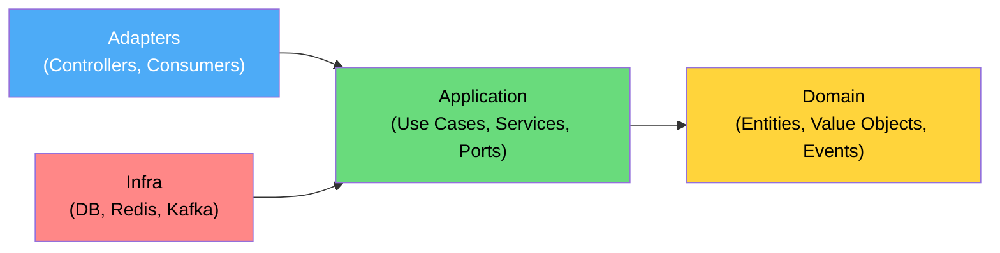

# 📁 Zalo-Delivery — Cấu trúc thư mục Backend

> Kiến trúc: **Modular Architecture** với **Hexagonal Lite** bên trong mỗi module

---

## Cấu trúc tổng quan

```
zalo-delivery/
├── docker-compose.yml          # PG, Redis, Kafka (KRaft), OSRM
├── Dockerfile                  # Multi-stage build
├── .env.example
├── .gitignore
├── .prettierrc
├── eslint.config.mjs
├── package.json
├── tsconfig.json
│
├── prisma/                     # (hoặc drizzle/) — DB schema & migrations
│   ├── schema.prisma
│   └── migrations/
│
├── scripts/                    # Standalone scripts
│   └── seed.ts                 # Seed data (shippers mẫu, etc.)
│
├── src/
│   ├── index.ts                # Entry point — bootstrap server
│   ├── app.ts                  # Express app setup (middleware, routes)
│   ├── server.ts               # HTTP + Socket.io server creation
│   │
│   ├── config/                 # ⚙️ Configuration layer
│   │   ├── index.ts            # Barrel export
│   │   ├── env.config.ts       # Zod-validated env vars
│   │   ├── database.config.ts  # PG connection config
│   │   ├── redis.config.ts     # Redis connection config
│   │   └── kafka.config.ts     # Kafka broker config
│   │
│   ├── shared/                 # 🔧 Shared kernel (cross-cutting)
│   │   ├── index.ts
│   │   ├── errors/
│   │   │   ├── app-error.ts        # Base AppError class
│   │   │   └── error-codes.ts      # Enum error codes
│   │   ├── middleware/
│   │   │   ├── error-handler.ts    # Global error handler
│   │   │   ├── request-logger.ts   # Pino request logging
│   │   │   ├── rate-limiter.ts     # Rate limiting
│   │   │   └── validate.ts         # Zod validation middleware
│   │   ├── logger/
│   │   │   └── logger.ts           # Pino logger instance
│   │   ├── interfaces/
│   │   │   ├── repository.interface.ts   # IRepository<T>
│   │   │   ├── use-case.interface.ts     # IUseCase<In, Out>
│   │   │   └── event-publisher.interface.ts
│   │   ├── utils/
│   │   │   ├── haversine.ts        # Distance calculation
│   │   │   ├── retry.ts            # Generic retry helper
│   │   │   └── id-generator.ts     # ULID/nanoid
│   │   └── types/
│   │       └── common.types.ts     # Shared type definitions
│   │
│   ├── infra/                  # 🏗️ Infrastructure adapters
│   │   ├── database/
│   │   │   ├── prisma-client.ts    # Singleton Prisma client
│   │   │   └── repositories/      # Concrete repo implementations
│   │   │       ├── order.repository.ts
│   │   │       ├── shipper.repository.ts
│   │   │       └── revenue.repository.ts
│   │   ├── redis/
│   │   │   ├── redis-client.ts     # ioredis singleton
│   │   │   ├── dedup.service.ts    # Message dedup (SET NX EX)
│   │   │   └── geo.service.ts      # GEOSEARCH, GEOADD, GEODIST
│   │   ├── kafka/
│   │   │   ├── kafka-client.ts     # KafkaJS client
│   │   │   ├── producer.ts         # Generic producer wrapper
│   │   │   ├── consumer.ts         # Generic consumer wrapper
│   │   │   └── topics.ts           # Topic name constants
│   │   ├── osrm/
│   │   │   └── osrm-client.ts      # HTTP client gọi OSRM API
│   │   ├── geocoding/
│   │   │   └── goong-client.ts     # Goong.io geocoding (hoặc Nominatim)
│   │   └── socket/
│   │       ├── socket-server.ts    # Socket.io server setup
│   │       └── namespaces/
│   │           └── tracking.ns.ts  # /tracking namespace
│   │
│   ├── modules/                # 📦 Business modules (Hexagonal Lite)
│   │   │
│   │   ├── webhook/            # ── Module: Webhook & Parser ──
│   │   │   ├── domain/
│   │   │   │   ├── entities/
│   │   │   │   │   └── parsed-order.entity.ts
│   │   │   │   └── value-objects/
│   │   │   │       ├── phone-number.vo.ts
│   │   │   │       └── address.vo.ts
│   │   │   ├── application/
│   │   │   │   ├── use-cases/
│   │   │   │   │   ├── process-webhook.use-case.ts
│   │   │   │   │   └── parse-message.use-case.ts
│   │   │   │   ├── services/
│   │   │   │   │   └── message-parser.service.ts  # Regex engine
│   │   │   │   └── ports/
│   │   │   │       ├── webhook-validator.port.ts
│   │   │   │       └── order-creator.port.ts
│   │   │   ├── adapters/
│   │   │   │   └── webhook.controller.ts   # POST /api/webhooks/zalo
│   │   │   └── index.ts
│   │   │
│   │   ├── order/              # ── Module: Order Management ──
│   │   │   ├── domain/
│   │   │   │   ├── entities/
│   │   │   │   │   └── order.entity.ts
│   │   │   │   ├── enums/
│   │   │   │   │   └── order-status.enum.ts
│   │   │   │   └── events/
│   │   │   │       ├── order-created.event.ts
│   │   │   │       └── order-completed.event.ts
│   │   │   ├── application/
│   │   │   │   ├── use-cases/
│   │   │   │   │   ├── create-order.use-case.ts
│   │   │   │   │   ├── update-order-status.use-case.ts
│   │   │   │   │   └── get-order.use-case.ts
│   │   │   │   └── ports/
│   │   │   │       └── order-repository.port.ts
│   │   │   ├── adapters/
│   │   │   │   └── order.controller.ts
│   │   │   └── index.ts
│   │   │
│   │   ├── dispatcher/         # ── Module: Dispatcher ──
│   │   │   ├── domain/
│   │   │   │   └── entities/
│   │   │   │       └── route.entity.ts
│   │   │   ├── application/
│   │   │   │   ├── use-cases/
│   │   │   │   │   ├── find-nearest-shipper.use-case.ts
│   │   │   │   │   └── assign-order.use-case.ts
│   │   │   │   ├── services/
│   │   │   │   │   └── route-optimizer.service.ts
│   │   │   │   └── ports/
│   │   │   │       ├── geo-search.port.ts
│   │   │   │       └── route-calculator.port.ts
│   │   │   ├── adapters/
│   │   │   │   └── dispatcher.consumer.ts  # Kafka consumer
│   │   │   └── index.ts
│   │   │
│   │   ├── shipper/            # ── Module: Shipper ──
│   │   │   ├── domain/
│   │   │   │   ├── entities/
│   │   │   │   │   └── shipper.entity.ts
│   │   │   │   └── enums/
│   │   │   │       └── shipper-status.enum.ts
│   │   │   ├── application/
│   │   │   │   ├── use-cases/
│   │   │   │   │   ├── toggle-status.use-case.ts
│   │   │   │   │   └── update-location.use-case.ts
│   │   │   │   └── ports/
│   │   │   │       └── shipper-repository.port.ts
│   │   │   ├── adapters/
│   │   │   │   └── shipper.controller.ts
│   │   │   └── index.ts
│   │   │
│   │   ├── tracking/           # ── Module: Geofencing & Tracking ──
│   │   │   ├── domain/
│   │   │   │   └── value-objects/
│   │   │   │       └── gps-point.vo.ts
│   │   │   ├── application/
│   │   │   │   ├── use-cases/
│   │   │   │   │   ├── process-gps-update.use-case.ts
│   │   │   │   │   └── check-geofence.use-case.ts
│   │   │   │   └── services/
│   │   │   │       └── geofence-checker.service.ts
│   │   │   ├── adapters/
│   │   │   │   └── tracking.socket-handler.ts
│   │   │   └── index.ts
│   │   │
│   │   └── revenue/            # ── Module: Revenue ──
│   │       ├── domain/
│   │       │   └── entities/
│   │       │       └── revenue-record.entity.ts
│   │       ├── application/
│   │       │   ├── use-cases/
│   │       │   │   ├── record-revenue.use-case.ts
│   │       │   │   └── get-revenue-summary.use-case.ts
│   │       │   └── ports/
│   │       │       └── revenue-repository.port.ts
│   │       ├── adapters/
│   │       │   ├── revenue.controller.ts
│   │       │   └── revenue.consumer.ts     # Kafka consumer
│   │       └── index.ts
│   │
│   ├── scripts/                # 🤖 Standalone scripts
│   │   └── shipper-simulator.ts    # Giả lập shipper di chuyển
│   │
│   └── routes/                 # 🛣️ Route aggregator
│       └── index.ts            # Mount tất cả controller routes
│
└── tests/                      # 🧪 Tests
    ├── unit/
    │   ├── message-parser.test.ts
    │   ├── haversine.test.ts
    │   └── geofence-checker.test.ts
    ├── integration/
    │   ├── webhook.test.ts
    │   └── dispatcher.test.ts
    └── helpers/
        └── test-setup.ts
```

---

## Giải thích kiến trúc Hexagonal Lite

Mỗi module trong `modules/` có 3 layer:



| Layer | Vai trò | Dependencies |
|---|---|---|
| **Domain** | Entities, Value Objects, business rules thuần | Không phụ thuộc gì |
| **Application** | Use Cases, Ports (interfaces), orchestration | Chỉ phụ thuộc Domain |
| **Adapters** | Controllers, Kafka consumers, Socket handlers | Phụ thuộc Application |
| **Infra** (shared) | Concrete implementations (DB, Redis, API calls) | Implement các Ports |

> [!NOTE]
> "Hexagonal Lite" = giữ nguyên tư tưởng Ports & Adapters nhưng không over-engineer. Không cần DI container phức tạp — dùng manual DI qua factory functions tại module `index.ts`.
