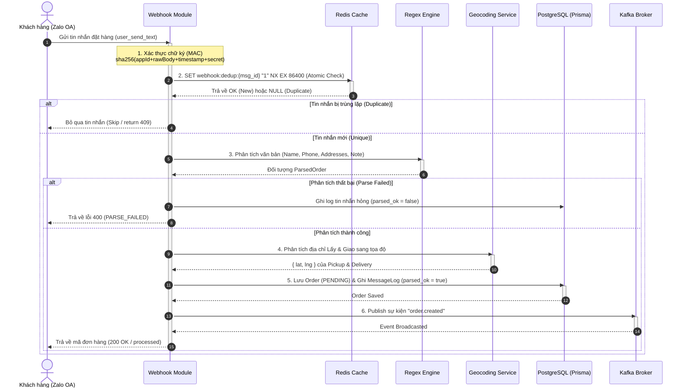

# 🛠️ Phase 1 Architecture: Webhook, Message Parser & Order Creation

Bản tài liệu này phân tích chi tiết **luồng xử lý đầu-cuối (End-to-End Flow)** của Phase 1 và vai trò của từng công nghệ trong **Tech Stack** để phục vụ việc xử lý tải cao, đảm bảo tính toàn vẹn dữ liệu và khả năng mở rộng của hệ thống Zalo-Delivery.

---

## 🔄 1. Luồng xử lý dữ liệu của Phase 1 (End-to-End Flow)

Sự kết hợp giữa **Zalo Webhook**, **Redis**, **PostgreSQL**, **Kafka** tạo nên một quy trình xử lý khép kín, bền bỉ và bất đồng bộ:

### Chi tiết từng bước trong luồng:
1.  **Tiếp nhận & Xác thực (Signature Verification)**:
    *   Khi Zalo OA gửi webhook, `Webhook Controller` tiếp nhận và trích xuất chữ ký từ header `x-zevent-signature`.
    *   Hệ thống băm SHA256 chuỗi ghép để xác thực nguồn gửi đến từ Zalo.
2.  **Chống trùng lặp (Redis Deduplication)**:
    *   Đảm bảo tính **Idempotency** (đơn trị). Khi Zalo gửi lại webhook (do timeout hoặc lag), hệ thống gọi atomic `SET key "1" NX EX 86400` trên Redis.
    *   If key đã tồn tại, tin nhắn lập tức bị loại bỏ, tránh việc tạo đơn hàng trùng lặp.
3.  **Tách lọc thông tin (Regex Parsing Engine)**:
    *   `parseOrderMessage` tách SĐT trước tiên, sau đó dọn dẹp chuỗi và áp dụng hệ thống so khớp nhãn (`Tên:`, `Giao:`, `Lấy:`) kết hợp kỹ thuật phân rã chuỗi thông minh (Split-by-delimiter) loại trừ dấu phẩy địa chỉ để nhận diện chính xác thông tin.
4.  **Bản đồ hóa địa chỉ (Geocoding)**:
    *   Địa chỉ dạng chữ được chuyển hóa thành cặp tọa độ kinh/vĩ độ (`lat`, `lng`) qua **Goong.io** hoặc **Nominatim OSM** phục vụ việc tính khoảng cách.
5.  **Lưu trữ & Khởi tạo (PostgreSQL & Prisma)**:
    *   Tạo bản ghi đơn hàng ở trạng thái `PENDING`, đồng thời lưu vết tin nhắn thành công liên kết với khóa ngoại của đơn hàng đó.
6.  **Kích hoạt bất đồng bộ (Kafka Event Publishing)**:
    *   Phát sự kiện `order.created` chứa thông tin tọa độ lên Kafka Topic để báo hiệu cho các module khác (như bộ định tuyến Dispatcher) tiếp quản mà không chặn tiến trình phản hồi của webhook.

---

## 💻 2. Vai trò của Tech Stack chính trong Phase 1

Mỗi công nghệ được lựa chọn đóng vai trò cốt lõi trong việc chịu tải cao và đảm bảo tính nhất quán:

| Công nghệ | Vai trò chủ chốt trong Phase 1 | Tại sao lại quan trọng? |
|---|---|---|
| **TypeScript & Express** | *Cốt lõi xử lý Logic & Routing* | Đảm bảo tính chặt chẽ về mặt dữ liệu (type-safe) thông qua Zod DTO, giảm thiểu tối đa các lỗi crash runtime khi tiếp nhận payload đa dạng từ Webhook. |
| **Redis** | *Distributed Lock / Deduplication* | Đóng vai trò là lá chắn vòng ngoài. Lệnh `SET NX EX` hoạt động ở mức nguyên tử (atomic) trên bộ nhớ RAM với thời gian đáp ứng dưới **1ms**, giúp ngăn chặn tuyệt đối tình trạng Race Condition khi Zalo gửi trùng gói tin. |
| **PostgreSQL & Prisma** | *Hệ cơ sở dữ liệu quan hệ (RDBMS)* | Đảm bảo tính **ACID** tuyệt đối cho các giao dịch đơn hàng và log tin nhắn (`Order` & `MessageLog`). Sử dụng Prisma ORM giúp truy vấn an toàn, quản lý các kết nối DB ổn định qua Pool kết nối. |
| **Kafka (Broker)** | *Hệ thống phân phối sự kiện (Event Streaming)* | Thực hiện **Decoupling** (cắt đứt sự phụ thuộc trực tiếp) giữa Webhook Module và Dispatcher Module. Khi đơn hàng được tạo, webhook lập tức trả về 200 OK cho Zalo; việc tìm tài xế sẽ diễn ra bất đồng bộ phía sau thông qua sự kiện `order.created`. Điều này giúp hệ thống chịu tải hàng ngàn đơn hàng/giây mà không bị nghẽn HTTP thread. |
| **Goong.io / Nominatim** | *Geocoding Layer* | Cung cấp tọa độ chính xác cho địa chỉ tại Việt Nam. Việc Geocode thành công là điều kiện tiên quyết để thuật toán so khớp khoảng cách địa lý (Haversine) chạy chuẩn xác ở Phase tiếp theo. |
