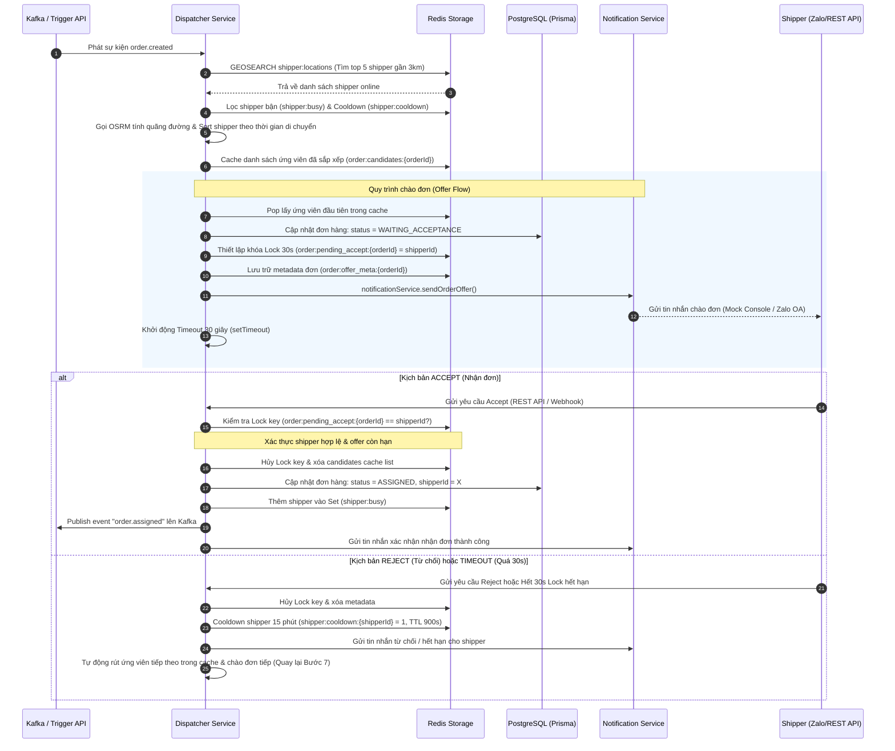

# Kiến Trúc Kỹ Thuật Phase 2.5 — Shipper Confirmation Flow

Tài liệu này trình bày chi tiết về luồng nghiệp vụ **Shipper Confirmation (Xác nhận đơn hàng)** và vai trò của các công nghệ trong kiến trúc hệ thống của **Phase 2.5** thuộc dự án Zalo Delivery Backend.

---

## 🏗️ Luồng Xử Lý Chi Tiết Từng Bước (Step-by-Step Flow)

Quy trình gán đơn tự động (Auto-Assign) của Phase 2 được nâng cấp thành luồng chào đơn kèm cơ chế xác nhận/từ chối từ shipper (Accept/Reject/Timeout). Luồng xử lý diễn ra chi tiết qua các bước sau:

---

## 🛠️ Vai Trò Của Các Tech Stack Chính Trong Phase 2.5

Mỗi công nghệ được sử dụng đóng vai trò quan trọng trong việc xây dựng luồng nghiệp vụ tin cậy, không nghẽn và có độ bền bỉ cao:

### 1. Redis (Cache, State Sets, Locks & TTL)
Redis đóng vai trò là **trung tâm quản lý trạng thái động và đồng bộ hóa thời gian thực** (Real-time State & Synchronization Hub):
*   **Atomic Lock (`order:pending_accept:{orderId}`)**: Sử dụng TTL 30 giây làm chốt khóa nguyên tử. Nó đảm bảo **chỉ duy nhất một shipper** có quyền phản hồi đơn hàng tại một thời điểm, ngăn chặn tuyệt đối lỗi race condition (nhiều shipper cùng nhận một đơn).
*   **Candidates Cache Queue (`order:candidates:{orderId}`)**: Lưu trữ danh sách ứng viên tiềm năng dạng JSON. Khi shipper trước từ chối, dispatcher chỉ việc pop ứng viên tiếp theo từ Redis thay vì phải quét lại Geo và gọi lại OSRM API, giúp **giảm thiểu 80% độ trễ (latency)** và tiết kiệm tài nguyên mạng.
*   **State Tracker (`shipper:busy`)**: Theo dõi các shipper đang làm việc để loại trừ khỏi danh sách tìm kiếm.
*   **Cooldown Manager (`shipper:cooldown:{shipperId}`)**: Sử dụng khóa tự động phân rã với TTL 900 giây (15 phút) làm bộ nhớ tạm, giúp hệ thống **tự động bỏ qua** shipper vừa từ chối đơn hàng mà không cần thực hiện truy vấn DB phức tạp.

### 2. PostgreSQL & Prisma ORM
Đóng vai trò là **Nguồn dữ liệu chuẩn duy nhất (Single Source of Truth)**:
*   Đảm bảo tính nhất quán dữ liệu giao dịch của đơn hàng khi thay đổi trạng thái chuyển tiếp (`PENDING` ➔ `WAITING_ACCEPTANCE` ➔ `ASSIGNED`).
*   Lưu trữ trường định danh duy nhất `zaloUserId` của shipper để phục vụ việc mapping và giao tiếp thật với Zalo OA ở các phase sau.

### 3. Kafka (Event-driven Messaging)
Đóng vai trò là **Bộ truyền tin phi liên kết (Decoupling & Event Pipeline)**:
*   Khi shipper accept đơn hàng, hệ thống phát sự kiện `order.assigned` lên Kafka. Các module ăn theo (Geofencing, Live Simulator, Revenue) sẽ tiêu thụ sự kiện này một cách bất đồng bộ. Điều này giúp dispatcher giải phóng tài nguyên cực nhanh, phản hồi HTTP cho shipper trong vòng vài mili-giây mà không bị block bởi các tiến trình xử lý sau đó.

### 4. OSRM (Open Source Routing Machine)
Đóng vai trò là **Bộ não tính toán lộ trình tối ưu**:
*   Tính toán khoảng cách di chuyển thực tế trên bản đồ đường bộ Việt Nam cùng thời gian lái xe dự kiến thay vì tính theo đường chim bay thẳng, mang lại độ chính xác tuyệt đối khi phân phối đơn.

### 5. Strategy Pattern (TypeScript Architecture)
Đóng vai trò là **Khung thiết kế trừu tượng linh hoạt**:
*   Tách biệt hoàn toàn tầng giao tiếp tin nhắn thông qua `INotificationService`.
*   Giúp dự án phát triển theo mô hình **Mock-first** tin cậy: toàn bộ core logic nghiệp vụ phức tạp được viết và unit test kỹ càng trên máy local thông qua Console Provider mà không cần phụ thuộc hay chờ đợi kết nối mạng / tài khoản Zalo OA thật của doanh nghiệp.

---
