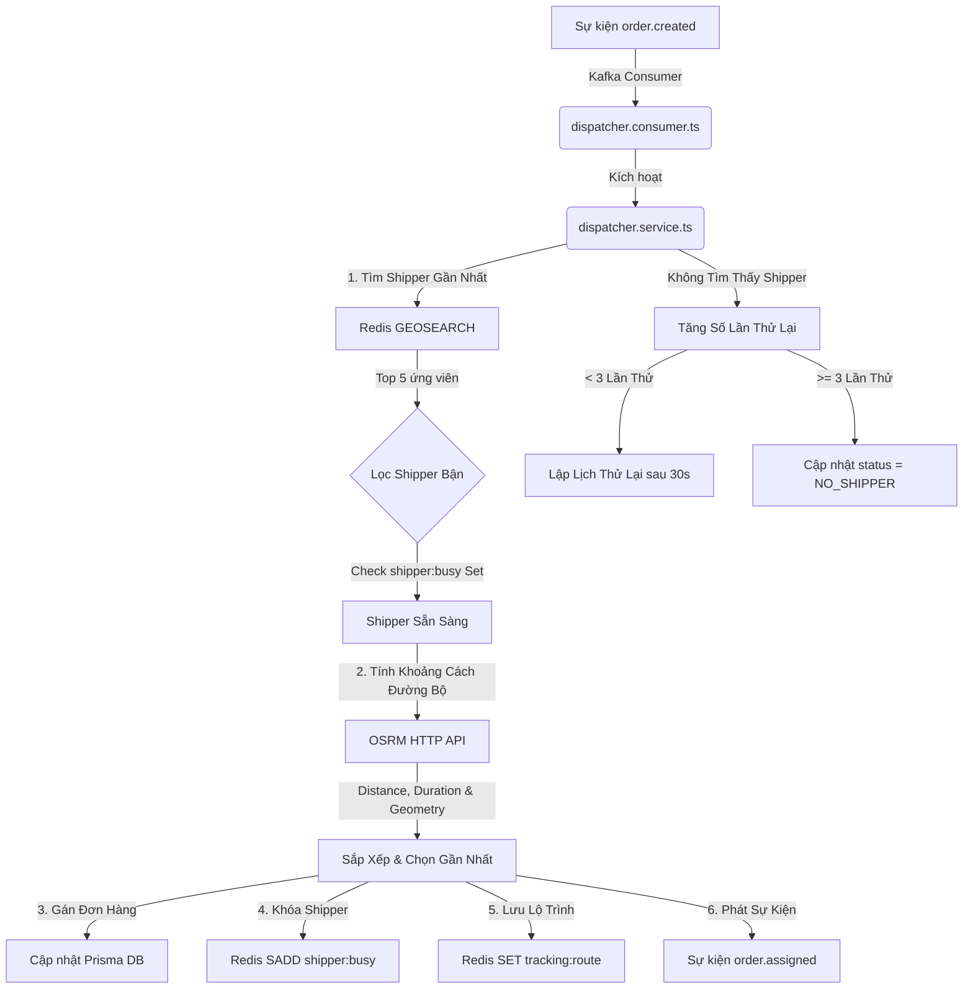

# Kiến Trúc Kỹ Thuật Phase 2 — Dispatcher & Tối Ưu Lộ Trình

Tài liệu này trình bày chi tiết về kiến trúc hệ thống, các thuật toán tìm đường và các mẫu đồng bộ hóa dữ liệu được triển khai cho **Phase 2** của Zalo Delivery Backend.

---

## 🏗️ Tổng Quan Kiến Trúc (Architectural Overview)

Phase 2 giới thiệu hai module nghiệp vụ mới (`shipper` và `dispatcher`), tích hợp thời gian di chuyển thực tế trên mạng lưới đường bộ qua **OSRM**, và điều phối gán đơn hàng bất đồng bộ ngay sau khi nhận được sự kiện tạo đơn hàng.

---

## 🛠️ Thiết Kế Thành Phần & Dữ Liệu (Components & Data Design)

### 1. Module Shipper (`src/modules/shipper/`)
Module `shipper` quản lý thông tin tài xế, phân loại phương tiện và chuyển đổi trạng thái hoạt động (ONLINE / OFFLINE).
*   **Database Schema (`prisma/schema.prisma`)**:
    *   Tài xế được lưu trong bảng `shippers` và được theo dõi trạng thái xóa mềm qua trường `deleted_at`.
    *   Được đánh index tại các trường `status` và `deleted_at` để tối ưu hóa hiệu năng truy vấn.
*   **Theo Dõi Tọa Độ Không Gian (`redis: shipper:locations`)**:
    *   Khi tài xế chuyển sang trạng thái **ONLINE**, họ sẽ gửi lên tọa độ `(lat, lng)`. Chúng ta thực hiện lệnh `GEOADD shipper:locations lng lat shipper_id` vào Redis.
    *   Khi tài xế chuyển sang trạng thái **OFFLINE** hoặc bị **Xóa**, hệ thống sẽ xóa sạch thông tin của họ bằng lệnh `ZREM shipper:locations shipper_id`.

### 2. Module Dispatcher (`src/modules/dispatcher/`)
Module `dispatcher` hoạt động hoàn toàn như một bộ điều phối hướng sự kiện (event-driven orchestrator) và không có các API HTTP chỉnh sửa trực tiếp vào cơ sở dữ liệu.
*   **Khóa Trạng Thái (`redis: shipper:busy`)**:
    *   Để tránh việc gán trùng một tài xế cho nhiều đơn hàng cùng một lúc, tài xế sẽ được đưa vào một Redis Set (`SADD shipper:busy shipper_id`) ngay khi họ được gán đơn.
    *   Tài xế sẽ được rút khỏi Set này (`SREM`) khi đơn hàng hoàn thành hoặc thất bại.

### 3. Bộ Tính Toán Lộ Trình (`src/infra/osrm/`)
Thay vì tính toán khoảng cách theo đường chim bay (thuật toán Haversine), bộ điều phối gửi yêu cầu tìm tuyến đường thực tế đến **OSRM Backend API** chạy trên cơ sở dữ liệu bản đồ Việt Nam.
*   **API Được Sử Dụng**: `/route/v1/driving/{lng1},{lat1};{lng2},{lat2}?geometries=geojson&overview=full`
*   **Tính Kiên Cường (Resiliency)**: Cấu hình giới hạn thời gian gọi HTTP tối đa là 5 giây (`AbortSignal.timeout`) để đảm bảo không làm nghẽn hàng đợi xử lý của dispatcher.

### 4. Cache Lộ Trình Động (`redis: tracking:route:{orderId}`)
Chúng ta lưu trữ mảng tọa độ GeoJSON nhận được từ OSRM vào Redis với thời hạn hết hạn (TTL) bằng `estimated_duration * 2` (gấp đôi thời gian di chuyển ước tính). Điều này giúp trình mô phỏng (simulator) và dashboard real-time có thể hiển thị chính xác lộ trình thực tế mà không cần gọi liên tiếp vào hệ thống OSRM.

### 5. Cơ Chế Thử Lại Bất Đồng Bộ (`redis: order:retry:{orderId}`)
Khi không có tài xế nào online xung quanh, thay vì báo lỗi thất bại ngay lập tức, dispatcher sử dụng một bộ lập lịch phi nghẽn (non-blocking in-memory scheduler) được hỗ trợ bởi Redis:
1.  Tăng số lần thử lại một cách nguyên tử (`order:retry:{orderId}`).
2.  Kích hoạt gọi hàm `setTimeout` chạy ngầm để thử thách gán lại đơn sau 30 giây.
3.  Nếu vẫn không tìm thấy tài xế sau **3 lần thử**, đơn hàng sẽ được đánh dấu trạng thái là `NO_SHIPPER`.

---

## 📏 Tuân Thủ Quy Tắc & Quy Ước Dự Án (Rules & Conventions Checklist)

*   **RULE-A01 & AI09 (Cấu Trúc Module)**: Cả `shipper` và `dispatcher` đều triển khai đầy đủ 100% cấu trúc file chuẩn (`controller`, `service`, `dto`, `types`, `index.ts`, `repository` nếu có tương tác DB).
*   **RULE-A07 (Ranh Giới Module)**: Các thay đổi trạng thái chéo module đều được đóng gói bên trong các service đích. Module `dispatcher` cập nhật trạng thái đơn hàng thông qua việc gọi `orderService.assignOrder` thay vì can thiệp trực tiếp vào database.
*   **RULE-R01 & R02 (Đặt Tên & TTL Redis)**: Các khóa Redis được tuân thủ nghiêm ngặt theo đúng cấu trúc chuẩn:
    *   `shipper:locations` (Geo Set)
    *   `shipper:busy` (State Set)
    *   `tracking:route:{orderId}` (kèm TTL động)
    *   `order:retry:{orderId}` (kèm TTL cố định 5 phút)
*   **RULE-C01 & C09 (Đảm Bảo Kiểu Dữ Liệu)**: Áp dụng Zod schema để kiểm tra tính hợp lệ của mọi payload dữ liệu đầu vào và các sự kiện Kafka, tự động suy luận ra các kiểu dữ liệu TypeScript tương ứng.
*   **RULE-T01 & T05 (Kiểm Thử Unit Test)**: Hoàn thành bộ kiểm thử Unit Test cô lập (Mock-based) cho `shipper.service.ts` and `dispatcher.service.ts` đạt tỷ lệ bao phủ logic 100% bằng Vitest.
