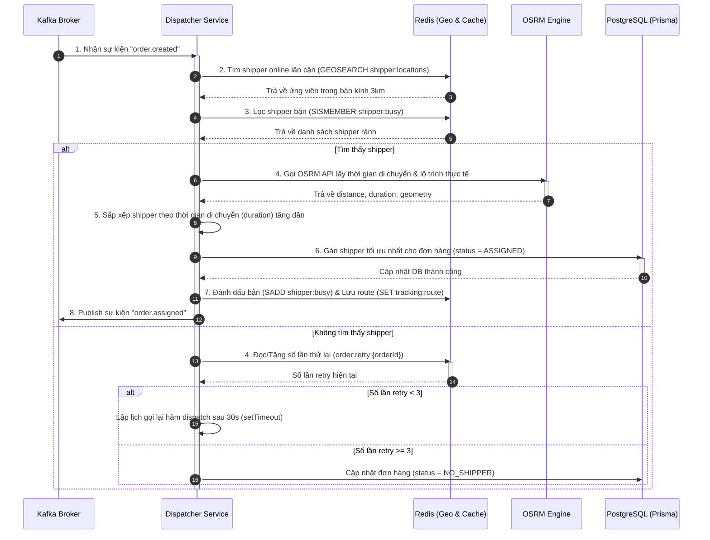

# 🛠️ Phase 2 Architecture: Dispatcher & Route Optimization

Bản tài liệu này phân tích chi tiết **luồng xử lý bất đồng bộ (Asynchronous Dispatching Flow)** của Phase 2 và vai trò của từng công nghệ trong **Tech Stack** để tối ưu hóa việc phân phối đơn hàng tới tài xế dựa trên lộ trình thực địa và khoảng cách di chuyển thực tế.

---

## 🔄 1. Luồng xử lý dữ liệu của Phase 2 (End-to-End Flow)

Sự kết hợp giữa **Kafka**, **Redis Geo/Set**, **OSRM Engine**, và **PostgreSQL** tạo nên một hệ thống tự động gán đơn phi liên kết có hiệu năng cao:

### Chi tiết từng bước trong luồng:
1.  **Tiếp nhận sự kiện (Kafka Consumer)**:
    *   `dispatcher.consumer.ts` lắng nghe sự kiện `order.created` từ Kafka và kích hoạt tiến trình điều phối đơn hàng chạy độc lập phía sau mà không block API Webhook.
2.  **Tìm kiếm lân cận (GeoSearch)**:
    *   Sử dụng lệnh `GEOSEARCH shipper:locations` trong Redis để tìm nhanh các shipper online trong phạm vi bán kính 3km từ điểm lấy hàng.
3.  **Lọc trạng thái bận (Busy Filtering)**:
    *   Kiểm tra xem các ứng viên có nằm trong Redis Set `shipper:busy` hay không để loại bỏ các tài xế đang giao đơn khác.
4.  **Tối ưu lộ trình (OSRM Routing)**:
    *   Gửi yêu cầu tới OSRM API để tính toán khoảng cách đường bộ và thời gian di chuyển (duration) thực tế từ vị trí hiện tại của shipper đến điểm lấy hàng.
5.  **Sắp xếp & Gán đơn (Prisma Update & Redis State)**:
    *   Sắp xếp danh sách ứng viên theo thời gian di chuyển tăng dần (duration ASC) và chọn shipper tối ưu nhất.
    *   Cập nhật trạng thái đơn hàng sang `ASSIGNED` qua Prisma, đưa shipper vào Redis Set `shipper:busy` để đánh dấu bận.
    *   Cache mảng tọa độ lộ trình GeoJSON vào Redis (`tracking:route:{orderId}`) với TTL bằng `duration * 2` để phục vụ theo dõi thời gian thực.
    *   Bắn sự kiện `order.assigned` lên Kafka để báo cho các module khác.
6.  **Thử lại bất đồng bộ (Retry Logic)**:
    *   Nếu không tìm thấy shipper nào rảnh, hệ thống tăng biến đếm thử lại (`order:retry:{orderId}`) trong Redis.
    *   Nếu số lần thử `< 3`, lập lịch gọi lại hàm điều phối sau 30 giây bằng `setTimeout`.
    *   Nếu vượt quá `3 lần`, đơn hàng được cập nhật trạng thái là `NO_SHIPPER`.

---

## 💻 2. Vai trò của Tech Stack chính trong Phase 2

| Công nghệ | Vai trò chủ chốt trong Phase 2 | Tại sao lại quan trọng? |
|---|---|---|
| **TypeScript & Express** | *Quản lý nghiệp vụ tài xế & DTO Validation* | Cung cấp các API quản lý CRUD shipper, thay đổi trạng thái online/offline của tài xế và đảm bảo dữ liệu đầu vào chuẩn hóa thông qua Zod validation. |
| **Redis (Geo & Sets)** | *Tìm kiếm lân cận & Đồng bộ hóa trạng thái tài xế* | Lệnh `GEOSEARCH` tìm tài xế dựa trên tọa độ cực nhanh. Redis Set `shipper:busy` lưu danh sách tài xế bận một cách an toàn và tối ưu tài nguyên hơn nhiều so với việc truy vấn cơ sở dữ liệu liên tục. |
| **OSRM Engine** | *Bộ tính toán định tuyến đường bộ* | Tính toán khoảng cách thực tế di chuyển bằng xe máy trên mạng lưới đường phố thực của Việt Nam thay vì khoảng cách chim bay, đem lại độ chính xác cao khi phân phối đơn. |
| **PostgreSQL & Prisma** | *Đảm bảo tính ACID của giao dịch gán đơn* | Lưu giữ thông tin tài xế và cập nhật trạng thái của đơn hàng, bảo vệ tính toàn vẹn dữ liệu khi gán đơn hàng cho shipper. |
| **Kafka (Broker)** | *Truyền sự kiện bất đồng bộ* | Tách biệt hoàn toàn Webhook và Dispatcher thông qua sự kiện `order.created`, cho phép hệ thống mở rộng và xử lý tải cao bất đồng bộ. |
