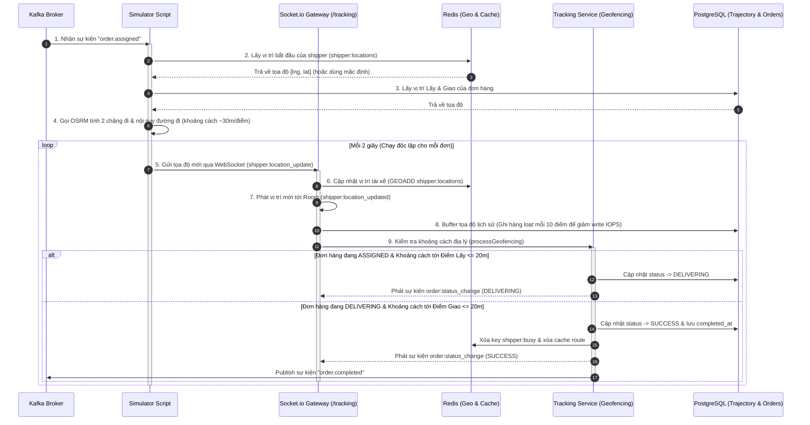

# 🛠️ Phase 3 Architecture: Real-time Tracking, Simulator & Geofencing

Bản tài liệu này phân tích chi tiết **luồng xử lý thời gian thực (Real-time Flow)** của Phase 3 & Phase 4, cách thức simulator hoạt động và vai trò của từng công nghệ trong **Tech Stack** để hiện thực hóa việc theo dõi vị trí tài xế, tự động cập nhật trạng thái đơn hàng dựa trên vị trí thực địa (Geofencing).

---

## 🔄 1. Luồng xử lý dữ liệu của Phase 3 (End-to-End Flow)

Sự kết hợp giữa **Kafka**, **Socket.io (WebSocket)**, **OSRM Router**, **Redis Geo**, và **PostgreSQL** tạo nên một hệ thống giám sát hành trình tự động và mượt mà:

### Chi tiết từng bước trong luồng:
1.  **Kích hoạt mô phỏng (Kafka Event Trigger)**:
    *   Khi shipper đồng ý nhận đơn, Dispatcher gửi sự kiện `order.assigned` lên Kafka.
    *   `Simulator Script` đang chạy dưới nền bắt được sự kiện và khởi động tiến trình mô phỏng hành trình cho cặp `(orderId, shipperId)`.
2.  **Định tuyến lộ trình thực địa (OSRM Routing & Interpolation)**:
    *   Simulator lấy vị trí hiện tại của shipper, điểm lấy hàng và điểm giao hàng.
    *   Gọi OSRM API để lấy danh sách các điểm nút giao thông thực tế trên bản đồ.
    *   Áp dụng công thức Haversine để nội suy thêm các điểm trung gian cách nhau ~30m, đảm bảo shipper di chuyển mượt mà trên bản đồ ảo thay vì dịch chuyển tức thời.
3.  **Giao tiếp hai chiều tốc độ cao (Socket.io Gateway)**:
    *   Mỗi 2 giây, Simulator gửi tọa độ hiện tại qua kênh WebSocket `/tracking` kèm token xác thực.
    *   Socket.io Gateway cập nhật ngay tọa độ mới của shipper vào Redis Geo để các dịch vụ khác có thể tìm kiếm lân cận.
    *   Đồng thời, Socket.io phát sóng (broadcast) tọa độ này xuống room `order:{orderId}` để các client (như giao diện theo dõi của khách hàng) cập nhật real-time.
4.  **Tối ưu hóa ghi dữ liệu (Batch Trajectory Buffer)**:
    *   Tọa độ di chuyển được lưu trữ tạm thời trong một bộ đệm (in-memory buffer).
    *   Khi bộ đệm đạt đủ 10 điểm tọa độ hoặc khi server tắt (graceful shutdown), hệ thống sẽ thực hiện một lệnh ghi duy nhất `createMany` xuống PostgreSQL để giảm tải đĩa cứng (disk write IOPS).
5.  **Tự động hóa nghiệp vụ (Geofencing Engine)**:
    *   Mỗi điểm GPS gửi lên đều được Geofencing Engine đo đạc khoảng cách tới điểm lấy hàng/giao hàng.
    *   Nếu shipper chạm mốc bán kính $\le$ 20m của điểm lấy hàng, đơn tự động chuyển sang `DELIVERING`.
    *   Nếu shipper chạm mốc bán kính $\le$ 20m của điểm giao hàng, đơn tự động chuyển sang `SUCCESS`, giải phóng tài xế khỏi danh sách bận (`shipper:busy`) trong Redis, xóa cache lộ trình và bắn sự kiện `order.completed` lên Kafka.

---

## 💻 2. Vai trò của Tech Stack chính trong Phase 3

| Công nghệ | Vai trò chủ chốt trong Phase 3 | Tại sao lại quan trọng? |
|---|---|---|
| **Socket.io (WebSockets)** | *Giao tiếp song hướng thời gian thực* | Cung cấp kết nối liên tục (persistent connection) có độ trễ cực thấp (<5ms), cho phép truyền tải tọa độ GPS tần suất cao và phát sóng tức thì sự thay đổi trạng thái đơn hàng tới các thiết bị đang theo dõi. |
| **Node.js (Standalone Script)** | *Mô phỏng hành trình không chặn (Non-blocking Simulator)* | Chạy dưới dạng tiến trình độc lập, lắng nghe trực tiếp Kafka để tự động sinh hành trình shipper di chuyển mà không chiếm dụng tài nguyên CPU/Memory của Web Server chính. |
| **OSRM (Open Source Routing Machine)** | *Định tuyến đường bộ thực tế* | Thay thế cho việc giả lập khoảng cách chim bay (đường thẳng), giúp shipper di chuyển men theo đúng hệ thống đường phố thực tế tại Việt Nam để đảm bảo tính thực tế của kịch bản kiểm thử. |
| **Redis (Geo Set & Lock Caching)** | *Lưu trữ vị trí động & Quản lý trạng thái bận* | Lệnh `GEOADD` giúp ghi nhận tọa độ tức thời cực nhanh. Hỗ trợ giải phóng tài xế khỏi `shipper:busy` và xóa cache lộ trình `tracking:route` ngay khi hoàn thành geofencing để tái chế tài xế cho đơn tiếp theo. |
| **PostgreSQL & Prisma** | *Lưu trữ lịch sử vết di chuyển (Trajectory) & Cập nhật trạng thái* | Đảm bảo tính nhất quán của trạng thái đơn hàng (`DELIVERING`, `SUCCESS`) và mốc thời gian hoàn thành. Cơ chế ghi gom cụm (batch insert) tối ưu hóa khả năng ghi đĩa của cơ sở dữ liệu. |
| **Kafka (Broker)** | *Cầu nối liên kết bất đồng bộ* | Simulator bắt đầu hoạt động nhờ sự kiện `order.assigned` và hệ thống kế toán/doanh thu (Revenue) bắt đầu chạy nhờ sự kiện `order.completed`, tạo nên kiến trúc hướng sự kiện (Event-Driven Architecture) hoàn hảo. |
