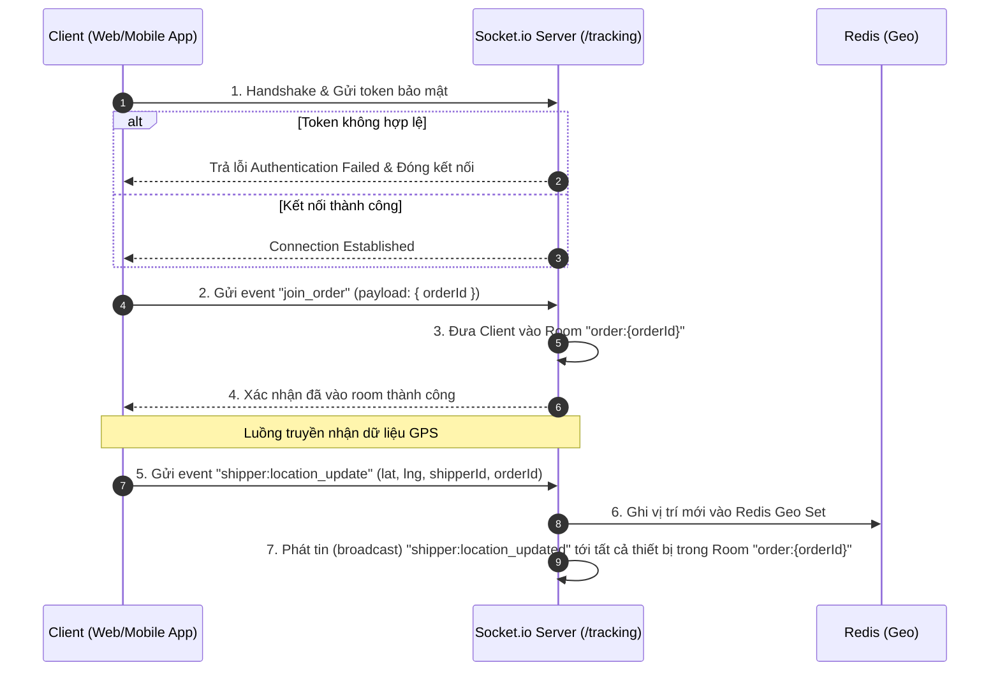

# 🛠️ Phase 4.5 Architecture: Order List REST API & WebSocket Protocol Specification

Bản tài liệu này mô tả chi tiết kiến trúc của **Phase 4.5: Order List API & WebSocket Protocol Spec**, thiết lập giao diện lập trình ứng dụng RESTful để liệt kê đơn hàng và đặc tả giao thức truyền nhận tọa độ qua WebSocket.

---

## 🔄 1. Thiết kế Giao thức & Luồng dữ liệu (REST & WebSocket spec)

Phase 4.5 chuẩn hóa cách thức Client kết nối, đăng ký theo dõi đơn hàng và nhận tọa độ GPS thời gian thực:

### 1.1 Giao tiếp REST API (Truy xuất danh sách đơn hàng)
*   **Endpoint**: `GET /api/orders`
*   **Chức năng**: Lấy danh sách các đơn hàng hiện có trong hệ thống (chưa bị xóa logic `deletedAt = null`), sắp xếp giảm dần theo thời gian tạo (`createdAt DESC`) để hiển thị các đơn mới nhất lên hàng đầu.
*   **Tầng xử lý**:
    *   `order.controller.ts` đón nhận request tại route `/`.
    *   `order.service.ts` gọi hàm `findAll()` từ `order.repository.ts`.
    *   Sử dụng Prisma Client để truy vấn nhanh PostgreSQL.

### 1.2 Giao tiếp WebSocket (Giao thức theo dõi thời gian thực `/tracking`)

Hệ thống sử dụng một Namespace riêng biệt `/tracking` trong Socket.io để tách biệt luồng dữ liệu GPS nặng nề ra khỏi các kết nối Socket thông thường khác:

### 1.3 Đặc tả các sự kiện WebSocket (Events Specification)

| Tên Event | Chiều gửi | Payload | Ý nghĩa |
|---|---|---|---|
| **`connection`** | Client $\rightarrow$ Server | `headers: { authorization: "Bearer token" }` | Yêu cầu kết nối và thực hiện xác thực Token ở middleware. |
| **`join_order`** | Client $\rightarrow$ Server | `{ orderId: "string" }` | Đăng ký theo dõi biến động vị trí và trạng thái của một đơn hàng cụ thể. |
| **`shipper:location_update`** | Client $\rightarrow$ Server | `{ orderId, shipperId, lat, lng }` | Simulator hoặc app shipper gửi tọa độ cập nhật định kỳ (mỗi 2 giây). |
| **`shipper:location_updated`**| Server $\rightarrow$ Client | `{ orderId, shipperId, lat, lng }` | Server phát lại tọa độ cho tất cả các Client đang hiển thị bản đồ theo dõi đơn hàng này. |
| **`order:status_change`** | Server $\rightarrow$ Client | `{ orderId, status }` | Phát đi thông báo khi đơn hàng thay đổi trạng thái (`DELIVERING`, `SUCCESS`, `FAILED`). |

---

## 💻 2. Vai trò của Tech Stack chính trong Phase 4.5

| Công nghệ | Vai trò chủ chốt trong Phase 4.5 | Tại sao lại quan trọng? |
|---|---|---|
| **Express & Router** | *Phân luồng API* | Đảm bảo định tuyến chính xác `GET /` đứng trước `/:id` để tránh việc Express nhầm lẫn chuỗi truy vấn danh sách đơn hàng với một ID đơn hàng cụ thể. |
| **Socket.io Namespaces** | *Phòng ban hóa luồng mạng* | Namespace `/tracking` giúp gom cụm logic xác thực và xử lý GPS, ngăn ngừa việc ảnh hưởng hiệu năng đến các tính năng realtime khác của hệ thống. |
| **Socket.io Rooms** | *Phân phối tin nhắn hướng đối tượng* | Gom nhóm người dùng theo từng ID đơn hàng `order:{id}`. Giúp server chỉ gửi tọa độ shipper đến những khách hàng đang thực sự chờ đơn hàng đó, tránh lãng phí băng thông mạng. |
| **Prisma ORM** | *Truy vấn cơ sở dữ liệu nhanh* | Cung cấp phương thức `findMany` ngắn gọn, hỗ trợ lọc và sắp xếp giảm dần cực kỳ dễ dàng mà không cần viết các câu lệnh SQL thô phức tạp. |
