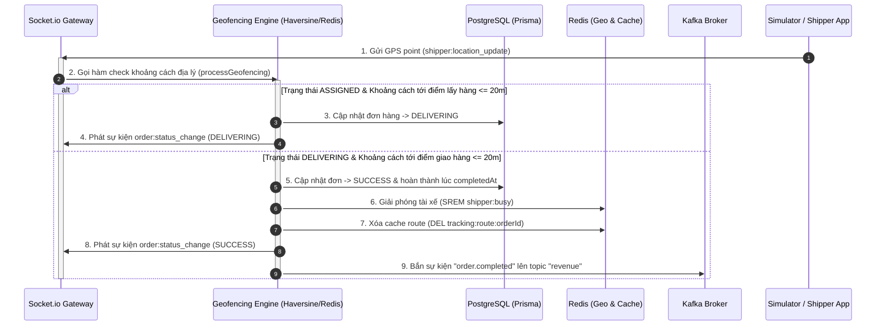

# 🛠️ Phase 4 Architecture: Geofencing, Order Completion & Event Trigger

Bản tài liệu này phân tích chi tiết cấu trúc kiến trúc và luồng xử lý của **Phase 4: Geofencing & Order Completion**, cách hệ thống phát hiện vị trí tài xế chạm mốc bán kính mục tiêu để tự động chuyển đổi trạng thái đơn hàng, và xuất sự kiện hoàn thành sang Kafka.

---

## 🔄 1. Luồng xử lý của Phase 4 (Geofencing & Completion Flow)

Sự phối hợp giữa Socket.io Gateway, Geofencing Engine, Redis Geo, Database (PostgreSQL) và Kafka tạo nên luồng khép kín của đơn hàng:

### Chi tiết các bước xử lý:
1.  **Đo đạc khoảng cách (Distance Checking & Geofencing)**:
    *   Mỗi khi Simulator hoặc Shipper gửi tọa độ GPS lên Server qua Socket.io, hệ thống thực hiện tính toán khoảng cách thực tế giữa shipper và điểm mục tiêu (điểm lấy hàng hoặc điểm giao hàng).
    *   Sử dụng công thức toán học **Haversine** (hoặc tập lệnh địa lý chuyên biệt `GEODIST` của Redis) để đo khoảng cách theo đường cong Trái Đất.
    *   **Ngưỡng kích hoạt (Threshold)** được quy định chặt chẽ là $\le 20$ mét để tránh sai số GPS và đảm bảo tính chính xác.
2.  **Chuyển đổi trạng thái tự động (Automated Transitions)**:
    *   **Nhận hàng (Pickup)**: Khi đơn ở trạng thái `ASSIGNED` và tài xế tiến sát điểm lấy hàng $\le 20$m, hệ thống tự động đổi trạng thái đơn hàng sang `DELIVERING` để thông báo cho khách hàng rằng shipper đã lấy hàng và đang trên đường giao.
    *   **Giao hàng (Completion)**: Khi đơn ở trạng thái `DELIVERING` và tài xế tiến sát điểm giao hàng $\le 20$m, hệ thống tự động cập nhật trạng thái đơn hàng sang `SUCCESS` kèm theo mốc thời gian hoàn thành (`completedAt`).
3.  **Thu hồi tài nguyên & Giải phóng tài xế (Resource Cleanup)**:
    *   Tài xế được xóa khỏi tập hợp bận `shipper:busy` trong Redis để quay về trạng thái sẵn sàng nhận các đơn mới (`ONLINE`).
    *   Xóa cache lộ trình di chuyển `tracking:route:{orderId}` để giải phóng bộ nhớ Redis.
    *   Simulator dừng vòng lặp gửi tọa độ định kỳ đối với đơn hàng này.
4.  **Báo cáo tài chính bất đồng bộ (Event Publishing)**:
    *   Hệ thống sinh một bản tin sự kiện hoàn tất đơn hàng `order.completed` chứa các thông tin tài chính: `{ orderId, shipperId, amount, completedAt }` cùng siêu dữ liệu (correlationId).
    *   Bản tin được gửi trực tiếp lên Kafka topic `revenue` để các module kế toán tiêu thụ và xử lý số liệu bất đồng bộ.

---

## 💻 2. Vai trò của Tech Stack chính trong Phase 4

| Công nghệ | Vai trò chủ chốt trong Phase 4 | Tại sao lại quan trọng? |
|---|---|---|
| **Redis** | *Quản lý phiên bận & Dọn dẹp cache* | Xóa tài xế khỏi khóa bận `shipper:busy` để tái sử dụng ngay lập tức, đồng thời dọn dẹp các dữ liệu route rác để tiết kiệm RAM tối đa. |
| **PostgreSQL & Prisma** | *Đảm bảo tính nhất quán của trạng thái đơn* | Cập nhật mốc trạng thái quan trọng (`DELIVERING`, `SUCCESS`, `completedAt`) một cách nhất quán, đóng vai trò là nguồn dữ liệu chính xác duy nhất (Single Source of Truth). |
| **Kafka** | *Đầu phát luồng sự kiện (Event Producer)* | Phát sự kiện `order.completed` một cách đáng tin cậy. Dữ liệu tài chính không bị nghẽn trực tiếp tại luồng HTTP của Web server mà được xử lý tách biệt ở tầng Revenue sau đó. |
| **Socket.io** | *Truyền thông điệp trạng thái tức thì* | Broadcast các sự kiện thay đổi trạng thái đơn hàng xuống các thiết bị người dùng cuối (như web/app của khách hàng) để hiển thị giao diện động thời gian thực. |
