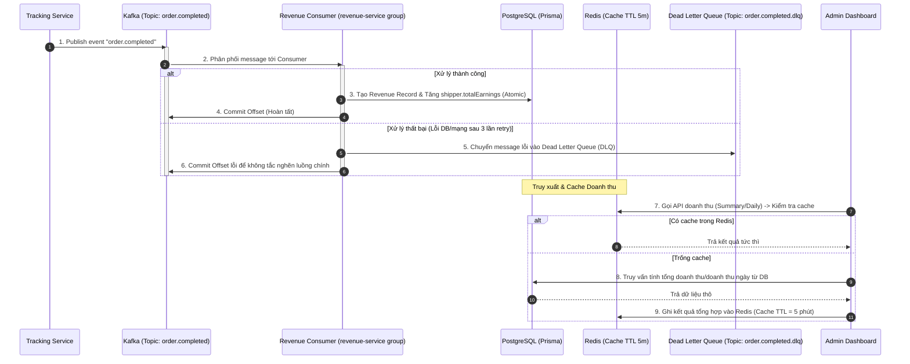

# 🛠️ Phase 5 Architecture: Revenue Module & Kafka Event-Driven Integration

Bản tài liệu này phân tích chi tiết kiến trúc hướng sự kiện (Event-Driven Architecture) của **Phase 5: Revenue Module & Kafka Integration**, cơ chế đồng bộ doanh thu tài xế phi tập trung và tối ưu hóa hiệu năng báo cáo tài chính bằng Redis Cache.

---

## 🔄 1. Thiết kế Hệ thống & Luồng dữ liệu (Kafka Consumer & Revenue Flow)

Sự kết hợp giữa Kafka Broker, Revenue Consumer, PostgreSQL Database và Redis Caching tạo nên hệ thống đối soát tài chính bất đồng bộ, đáng tin cậy:

### 1.1 Tách biệt nghiệp vụ bằng Kafka (Asynchronous Decoupling)
*   **Event Trigger**: Khi đơn hàng chuyển sang `SUCCESS` trong Geofencing Engine, hệ thống không gọi trực tiếp dịch vụ doanh thu để tránh làm chậm luồng socket. Thay vào đó, nó gửi bản tin sự kiện `order.completed` lên Kafka.
*   **Revenue Consumer**: Lắng nghe độc lập thuộc consumer group `revenue-service`. Khi nhận được thông tin hoàn thành đơn, consumer thực hiện hai hành động nghiệp vụ nguyên tử (atomic):
    1.  Tạo bản ghi đối soát doanh thu mới trong bảng `RevenueRecord` (Flat fee: 30,000 VND).
    2.  Tăng trực tiếp thu nhập tích lũy của tài xế (`totalEarnings`) trong bảng `Shipper` bằng cơ chế increment nguyên tử của database để tránh tranh chấp ghi (race conditions).

### 1.2 Thiết kế Tự phục hồi & Giám sát (Fault Tolerance & Monitoring)
*   **Dead Letter Queue (DLQ)**: Khi consumer gặp sự cố không thể xử lý tin nhắn (ví dụ: mất kết nối DB), hệ thống sẽ tiến hành thử lại (retry). Nếu vượt quá số lần cấu hình, tin nhắn sẽ được đẩy sang topic `order.completed.dlq` để kiểm tra thủ công, tránh gây nghẽn hàng đợi chính.
*   **Giám sát Consumer Lag**: Cung cấp endpoint đo đạc khoảng cách giữa offset hiện tại của phân vùng và offset đã được commit, giúp cảnh báo kịp thời nếu luồng xử lý doanh thu bị chậm trễ so với thực tế.

### 1.3 Tối ưu hóa truy vấn doanh thu (Caching Aggregations)
Các API doanh thu thường yêu cầu các hàm gộp nặng như `SUM`, `COUNT` và `GROUP BY` trên toàn bộ tập dữ liệu lịch sử:
*   `GET /api/revenue/summary`: Tổng doanh thu toàn hệ thống, tổng số đơn thành công.
*   `GET /api/revenue/daily`: Thống kê doanh thu theo ngày (hỗ trợ bộ lọc khoảng thời gian `from` và `to`).
*   **Cơ chế Caching**: Để bảo vệ database khỏi các truy vấn gộp liên tục từ admin dashboard, kết quả tính toán được cache vào Redis dưới dạng JSON với **Time-To-Live (TTL) là 5 phút**.

---

## 💻 2. Vai trò của Tech Stack chính trong Phase 5

| Công nghệ | Vai trò chủ chốt trong Phase 5 | Tại sao lại quan trọng? |
|---|---|---|
| **KafkaJS** | *Truyền nhận sự kiện phân tán đáng tin cậy* | Hỗ trợ cấu hình số lần thử lại (retries), quản lý offset tự động và cơ chế cô lập lỗi thông qua DLQ để đảm bảo không thất thoát bất kỳ giao dịch tài chính nào. |
| **Prisma Transactions** | *Đảm bảo tính trọn vẹn của dữ liệu tài chính* | Gói gọn việc tạo bản ghi doanh thu và cập nhật thu nhập tài xế vào một giao dịch cơ sở dữ liệu duy nhất. Nếu một trong hai bước lỗi, toàn bộ giao dịch sẽ rollback để tránh mất cân đối số liệu. |
| **Redis (String Cache)** | *Giảm tải database cho các truy vấn aggregate* | Lưu trữ kết quả tổng hợp doanh thu ngày/tháng giúp phản hồi API dashboard cực nhanh (<3ms) thay vì phải quét hàng triệu dòng dữ liệu trong PostgreSQL ở mỗi request. |
| **PostgreSQL** | *Lưu trữ lịch sử giao dịch gốc* | Đóng vai trò là sổ cái kế toán đáng tin cậy (ledger database), lưu vết mọi giao dịch tài chính phát sinh từ hệ thống giao hàng. |
