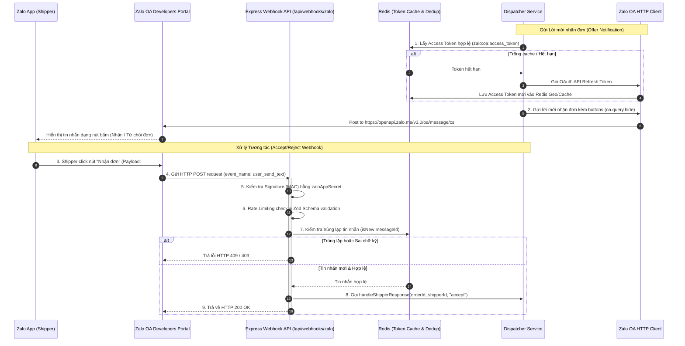

# 🛠️ Phase 6 Architecture: Production Hardening & Official Zalo OA Integration

Bản tài liệu này phân tích chi tiết các lớp bảo mật bảo vệ hệ thống và kiến trúc tích hợp với **Zalo Official Account (OA) Developers API**, quản lý vòng đời Access Token và xử lý phản hồi tương tác từ tài xế trực tiếp trên ứng dụng Zalo thật.

---

## 🔄 1. Luồng tích hợp Zalo OA & Cơ chế Xác thực (Zalo OA Integration Flow)

Kiến trúc liên kết giữa Zalo Platform, Public Tunnel, Webhook Handler, Redis Deduplication và Notification Service:

### 1.1 Quản lý Vòng đời Access Token của Zalo OA
*   **Vấn đề**: Access Token của Zalo OA chỉ có thời hạn sử dụng là 25 giờ, trong khi Refresh Token có thời hạn 90 ngày. Hệ thống cần quản lý tự động làm mới để tránh gián đoạn dịch vụ.
*   **Giải pháp**: Thiết lập `zalo-token.service.ts` lưu Access Token trong Redis với cơ chế tự động gia hạn:
    *   Trước mỗi lần gửi tin nhắn, hệ thống kiểm tra token trong Redis `zalo:oa:access_token`.
    *   Nếu token sắp hết hạn hoặc không tồn tại, client tự động gửi yêu cầu `POST /access_token` tới Zalo OAuth Server để nhận cặp khóa mới, cập nhật lại vào Redis Cache.

### 1.2 Xử lý Webhook & Bảo mật sản xuất (Production Hardening)
Hệ thống webhook là mục tiêu nhắm tới của các cuộc tấn công DDoS và tin tặc giả lập request. Các lớp bảo vệ đã triển khai bao gồm:
*   **Webhook Signature Verification**: Xác thực nguồn gốc tin nhắn từ Zalo gửi tới thông qua thuật toán băm SHA256 kết hợp giữa `appId`, `data`, `timestamp` và `ZALO_APP_SECRET`. Bất kỳ request nào không khớp mã MAC đều bị loại bỏ ngay lập tức với mã lỗi `403 Forbidden` (bỏ qua trong chế độ `development` để hỗ trợ lập trình viên dev offline).
*   **Message Deduplication (Chống trùng lặp)**: Sử dụng Redis Set với TTL 24 giờ để theo dõi `messageId`. Nếu Zalo retry gửi lại webhook do độ trễ mạng, hệ thống phát hiện trùng và chặn xử lý lần 2, tránh tình trạng duplicate đơn hàng hoặc chấp nhận đơn nhiều lần.
*   **Rate Limiting**: Giới hạn tần suất request tối đa vào endpoint webhook bằng `express-rate-limit` để tránh quá tải máy chủ.
*   **Helmet & Zod Validation**: Ẩn các tiêu đề HTTP nhạy cảm và kiểm tra cấu trúc dữ liệu đầu vào nghiêm ngặt bằng Zod trước khi đưa vào luồng nghiệp vụ.

### 1.3 Cơ chế Auto-Capture thông tin Shipper
*   Khi tài xế thực hiện quét mã QR và nhấn **Quan tâm (Follow)** trang Zalo Official Account của doanh nghiệp, Zalo gửi sự kiện `follow` tới webhook.
*   Hệ thống bắt sự kiện này, lấy Zalo User ID (UID) của shipper và gọi API `getprofile` của Zalo để đối chiếu tên tài xế trên thực tế.
*   Sau đó tự động cập nhật `zaloUserId` tương ứng vào cơ sở dữ liệu PostgreSQL. Kể từ thời điểm này, toàn bộ tin nhắn mời nhận đơn sẽ được gửi trực tiếp tới điện thoại của tài xế đó qua ứng dụng Zalo thật.

---

## 💻 2. Vai trò của Tech Stack chính trong Phase 6

| Công nghệ | Vai trò chủ chốt trong Phase 6 | Tại sao lại quan trọng? |
|---|---|---|
| **Redis (Token Cache & TTL)** | *Lưu trữ tập trung Access Token & Chống trùng* | Tiết kiệm số lần gọi API refresh token của Zalo (tránh chạm giới hạn rate limit của Zalo) và đảm bảo tính idempotent của webhook bằng lệnh `isNew`. |
| **Express-Rate-Limit** | *Chống tấn công DDoS* | Giới hạn số lượng request đến từ một IP trong một khoảng thời gian nhất định, bảo vệ server Express khỏi nguy cơ bị nghẽn mạng hoặc cạn kiệt tài nguyên. |
| **Helmet** | *Bảo mật HTTP Headers* | Thiết lập các tiêu đề bảo mật tiêu chuẩn (X-DNS-Prefetch-Control, Frame Options, v.v.), ẩn thông tin server (X-Powered-By) để hạn chế hacker khai thác lỗi hệ điều hành. |
| **Zod Schema** | *Kiểm tra định dạng dữ liệu đầu vào* | Chặn đứng các payload dị hình hoặc mã độc SQL Injection từ vòng ngoài trước khi dữ liệu được chuyển sâu vào tầng logic dịch vụ. |
| **Zalo OpenAPI Client** | *Giao tiếp cổng Zalo* | Đóng vai trò cầu nối giao tiếp với Zalo Server, định dạng các bản tin tương tác CS (Customer Support) kèm nút bấm để tương tác trực quan với shipper. |
