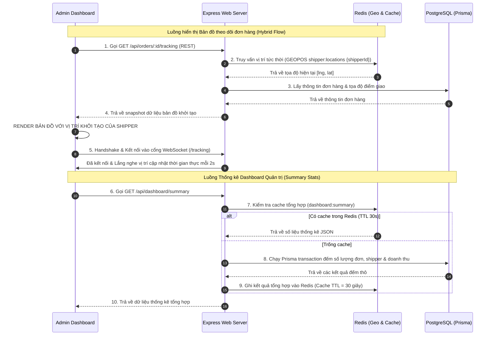

# 🛠️ Phase 7 Architecture: Tracking & Admin Dashboard REST APIs

Bản tài liệu này phân tích chi tiết thiết kế hệ thống của **Phase 7: Tracking & Dashboard APIs**, giải pháp kết hợp Hybrid (REST + WebSockets) để tối ưu hiển thị vị trí tức thời và các thuật toán phân trang, lọc dữ liệu, tổng hợp báo cáo tài chính trên trang quản trị.

---

## 🔄 1. Thiết kế Hệ thống & Luồng dữ liệu (Tracking & Dashboard APIs)

Sự kết hợp giữa REST API (lấy dữ liệu khởi tạo) và WebSockets (truyền tải dữ liệu động liên tục) tạo nên trải nghiệm theo dõi mượt mà trên Dashboard của người quản trị:

### 1.1 Chi tiết các điểm cuối REST API nâng cấp (REST Endpoints)

Hệ thống thiết lập 6 endpoint bổ trợ quan trọng:

1.  **Lịch sử di chuyển (`GET /api/orders/:id/trajectory`)**:
    *   Truy vấn trực tiếp bảng `trajectory_points` trong cơ sở dữ liệu để lấy toàn bộ danh sách tọa độ lịch sử mà shipper đã đi qua. Dữ liệu này dùng để vẽ lại đường chạy thực tế của shipper trên bản đồ (map replay).
2.  **Chi tiết đơn hàng mở rộng (`GET /api/orders/:id`)**:
    *   Nâng cấp thông tin trả về bao gồm: Chi tiết thông tin tài xế (`shipper`), số lượng điểm tọa độ GPS đã ghi nhận (`trajectoryCount`), và hồ sơ doanh thu tương ứng (`revenues`) nếu đơn hàng đã hoàn tất.
3.  **Lọc và phân trang danh sách đơn hàng (`GET /api/orders`)**:
    *   Hỗ trợ lọc động: theo danh sách trạng thái `?status=ASSIGNED,DELIVERING` (ngăn cách bằng dấu phẩy), theo mã tài xế `?shipperId=xxx`, hoặc khoảng thời gian tạo đơn `?from=...&to=...`.
    *   Hỗ trợ phân trang offset-based (`?page=1&limit=20`), thực hiện truy vấn đồng thời `count` tổng số dòng và `findMany` dữ liệu trong một Prisma Transaction để đảm bảo tính đồng bộ và tăng tốc độ xử lý.
4.  **Tổng hợp báo cáo Dashboard (`GET /api/dashboard/summary`)**:
    *   Tính toán số liệu tổng quan: đếm số đơn hàng theo từng trạng thái (7 trạng thái), đếm số lượng shipper theo trạng thái vận hành (ONLINE/OFFLINE/BUSY), và tổng doanh thu toàn hệ thống.
    *   Sử dụng Redis Cache với thời gian lưu trữ ngắn **(TTL = 30 giây)** để bảo vệ hệ thống khỏi việc quá tải database khi nhiều quản trị viên cùng truy cập trang chủ điều hành.
5.  **Snapshot vị trí trực tuyến của đơn hàng (`GET /api/orders/:id/tracking`)**:
    *   Truy vấn tọa độ GPS hiện tại của shipper đang xử lý đơn hàng cụ thể trực tiếp từ bộ nhớ Redis Geo (`GEOPOS`). Chỉ khả dụng cho đơn hàng ở trạng thái `ASSIGNED` hoặc `DELIVERING`.
6.  **Vị trí hiện tại của Shipper bất kỳ (`GET /api/shippers/:id/location`)**:
    *   Lấy vị trí GPS tức thời của một shipper cụ thể từ Redis Geo để hiển thị trực tiếp lên bản đồ giám sát chung của tổng đài điều phối.

---

## 💻 2. Vai trò của Tech Stack chính trong Phase 7

| Công nghệ | Vai trò chủ chốt trong Phase 7 | Tại sao lại quan trọng? |
|---|---|---|
| **Redis (Geo Commands)** | *Lấy tọa độ snapshot tức thời* | Lệnh `GEOPOS` truy xuất tọa độ GPS từ RAM cực nhanh (<1ms), cho phép frontend lấy ngay vị trí bắt đầu vẽ bản đồ trước khi chuyển giao hoàn toàn cho WebSocket. |
| **Redis (Key-Value Cache)** | *Bộ đệm bảo vệ database* | Lưu trữ số liệu dashboard summary trong 30s giúp giảm tải việc thực hiện liên tiếp các lệnh đếm đắt đỏ (`COUNT`, `SUM`) trên PostgreSQL. |
| **Prisma Transactions** | *Tối ưu hóa phân trang & Thống kê* | Gộp các câu lệnh `count` và `findMany` (hoặc các câu lệnh count thống kê đơn hàng) thành một khối giao dịch duy nhất để tránh xung đột dữ liệu và tăng tốc độ xử lý ở tầng database. |
| **PostgreSQL** | *Lưu trữ lịch sử tọa độ gốc* | Bảng `TrajectoryPoint` lưu trữ hàng nghìn điểm tọa độ lịch sử của tài xế một cách đáng tin cậy phục vụ tính năng vẽ lại lộ trình (route replay). |
