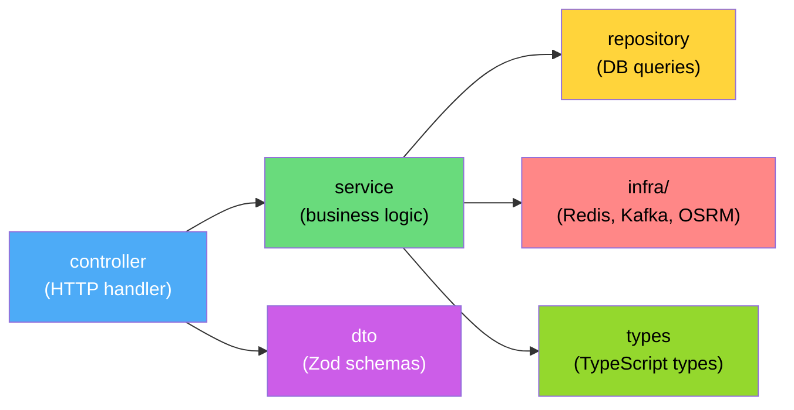

# 📁 Zalo-Delivery — Cấu trúc thư mục Backend

> Kiến trúc: **Modular Architecture** — mỗi module tự quản lý controller, service, repository, dto của mình

---

## Cấu trúc tổng quan

```
zalo-delivery/
├── docker-compose.yml          # PG, Redis, Kafka (KRaft), OSRM
├── Dockerfile                  # Multi-stage build
├── .env.example
├── .gitignore
├── .prettierrc
├── eslint.config.mjs
├── package.json
├── tsconfig.json
│
├── prisma/                     # DB schema & migrations
│   ├── schema.prisma
│   └── migrations/
│
├── scripts/                    # Standalone scripts
│   └── seed.ts                 # Seed data (shippers mẫu, etc.)
│
├── src/
│   ├── index.ts                # Entry point — bootstrap server
│   ├── app.ts                  # Express app setup (middleware, routes)
│   ├── server.ts               # HTTP + Socket.io server creation
│   │
│   ├── config/                 # ⚙️ Configuration layer
│   │   ├── index.ts            # Barrel export
│   │   ├── env.config.ts       # Zod-validated env vars
│   │   ├── database.config.ts  # PG connection config
│   │   ├── redis.config.ts     # Redis connection config
│   │   └── kafka.config.ts     # Kafka broker config
│   │
│   ├── shared/                 # 🔧 Shared kernel (cross-cutting)
│   │   ├── index.ts
│   │   ├── errors/
│   │   │   ├── app-error.ts        # Base AppError class
│   │   │   └── error-codes.ts      # Enum error codes
│   │   ├── middleware/
│   │   │   ├── error-handler.ts    # Global error handler
│   │   │   ├── request-logger.ts   # Pino request logging
│   │   │   ├── rate-limiter.ts     # Rate limiting
│   │   │   └── validate.ts         # Zod validation middleware
│   │   ├── logger/
│   │   │   └── logger.ts           # Pino logger instance
│   │   └── utils/
│   │       ├── haversine.ts        # Distance calculation
│   │       ├── retry.ts            # Generic retry helper
│   │       └── id-generator.ts     # ULID/nanoid
│   │
│   ├── infra/                  # 🏗️ Infrastructure layer
│   │   ├── database/
│   │   │   └── prisma-client.ts    # Singleton Prisma client
│   │   ├── redis/
│   │   │   ├── redis-client.ts     # ioredis singleton
│   │   │   ├── dedup.service.ts    # Message dedup (SET NX EX)
│   │   │   └── geo.service.ts      # GEOSEARCH, GEOADD, GEODIST
│   │   ├── kafka/
│   │   │   ├── kafka-client.ts     # KafkaJS client
│   │   │   ├── producer.ts         # Generic producer wrapper
│   │   │   ├── consumer.ts         # Generic consumer wrapper
│   │   │   └── topics.ts           # Topic name constants
│   │   ├── osrm/
│   │   │   └── osrm-client.ts      # HTTP client gọi OSRM API
│   │   ├── geocoding/
│   │   │   └── goong-client.ts     # Goong.io geocoding
│   │   └── socket/
│   │       ├── socket-server.ts    # Socket.io server setup
│   │       └── namespaces/
│   │           └── tracking.ns.ts  # /tracking namespace
│   │
│   ├── modules/                # 📦 Business modules
│   │   │
│   │   ├── webhook/            # ── Module: Webhook & Parser ──
│   │   │   ├── webhook.controller.ts   # POST /api/webhooks/zalo
│   │   │   ├── webhook.service.ts      # Business logic, Regex engine
│   │   │   ├── webhook.dto.ts          # Request/Response schemas (Zod)
│   │   │   ├── webhook.types.ts        # ParsedOrder, etc.
│   │   │   ├── webhook.consumer.ts     # (nếu cần nhận từ Kafka)
│   │   │   └── index.ts                # Barrel export + router mount
│   │   │
│   │   ├── order/              # ── Module: Order Management ──
│   │   │   ├── order.controller.ts     # REST endpoints
│   │   │   ├── order.service.ts        # Business logic
│   │   │   ├── order.repository.ts     # DB queries (Prisma)
│   │   │   ├── order.dto.ts            # Request/Response schemas (Zod)
│   │   │   ├── order.types.ts          # Order, OrderStatus, etc.
│   │   │   └── index.ts
│   │   │
│   │   ├── dispatcher/         # ── Module: Dispatcher ──
│   │   │   ├── dispatcher.service.ts   # Find shipper + assign logic
│   │   │   ├── dispatcher.consumer.ts  # Kafka consumer: order.created
│   │   │   ├── dispatcher.dto.ts       # Event schemas (Zod)
│   │   │   ├── dispatcher.types.ts     # Route, AssignResult, etc.
│   │   │   └── index.ts
│   │   │
│   │   ├── shipper/            # ── Module: Shipper ──
│   │   │   ├── shipper.controller.ts   # REST endpoints
│   │   │   ├── shipper.service.ts      # Business logic
│   │   │   ├── shipper.repository.ts   # DB queries (Prisma)
│   │   │   ├── shipper.dto.ts          # Request/Response schemas (Zod)
│   │   │   ├── shipper.types.ts        # Shipper, ShipperStatus, etc.
│   │   │   └── index.ts
│   │   │
│   │   ├── tracking/           # ── Module: Geofencing & Tracking ──
│   │   │   ├── tracking.service.ts     # GPS update + geofence check
│   │   │   ├── tracking.socket.ts      # Socket.io event handlers
│   │   │   ├── tracking.dto.ts         # GPS payload schemas (Zod)
│   │   │   ├── tracking.types.ts       # GpsPoint, GeofenceResult, etc.
│   │   │   └── index.ts
│   │   │
│   │   └── revenue/            # ── Module: Revenue ──
│   │       ├── revenue.controller.ts   # REST endpoints
│   │       ├── revenue.service.ts      # Business logic
│   │       ├── revenue.repository.ts   # DB queries (Prisma)
│   │       ├── revenue.consumer.ts     # Kafka consumer: order.completed
│   │       ├── revenue.dto.ts          # Request/Response schemas (Zod)
│   │       ├── revenue.types.ts        # RevenueRecord, Summary, etc.
│   │       └── index.ts
│   │
│   ├── scripts/                # 🤖 Standalone scripts
│   │   └── shipper-simulator.ts    # Giả lập shipper di chuyển
│   │
│   └── routes/                 # 🛣️ Route aggregator
│       └── index.ts            # Mount tất cả module routers
│
└── tests/                      # 🧪 Tests
    ├── unit/
    │   ├── webhook.service.test.ts
    │   ├── dispatcher.service.test.ts
    │   ├── tracking.service.test.ts
    │   └── haversine.test.ts
    ├── integration/
    │   ├── webhook.test.ts
    │   ├── order.test.ts
    │   └── dispatcher.test.ts
    └── helpers/
        └── test-setup.ts
```

---

## Giải thích kiến trúc Module

Mỗi module trong `modules/` tự chứa toàn bộ logic của mình theo cấu trúc phẳng:



| File | Vai trò | Ghi chú |
|---|---|---|
| `{module}.controller.ts` | Nhận HTTP request, validate, gọi service, trả response | Không chứa business logic |
| `{module}.service.ts` | Business logic chính của module | Orchestrate repository + infra |
| `{module}.repository.ts` | Tương tác DB qua Prisma | Chỉ query, không có logic |
| `{module}.consumer.ts` | Kafka consumer (nếu module cần nhận event) | Gọi service khi nhận message |
| `{module}.dto.ts` | Zod schemas cho request/response/event | Single source of truth cho shape |
| `{module}.types.ts` | TypeScript types/interfaces của module | Infer từ Zod hoặc định nghĩa thủ công |
| `index.ts` | Barrel export + Express Router setup | Entry point của module |

> [!NOTE]
> Cross-module communication chỉ qua **Kafka events** hoặc inject **service** vào nhau thông qua `index.ts`. KHÔNG import trực tiếp giữa các file bên trong module khác.

> [!TIP]
> Mỗi module `index.ts` export một `router` (Express Router) và một `initModule()` function để bootstrap Kafka consumers, Socket handlers, v.v.
