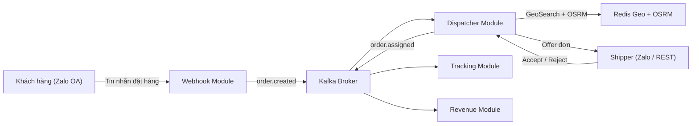
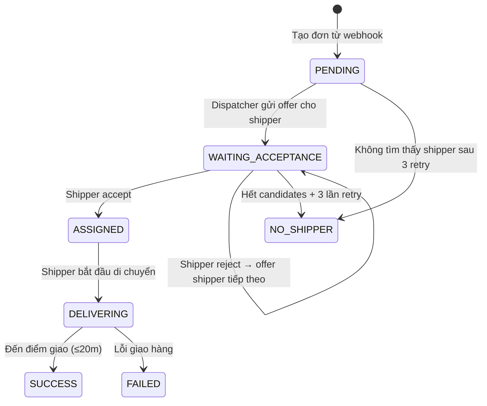
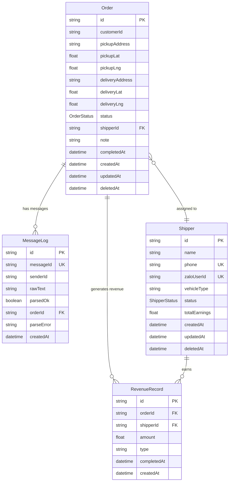

# 📋 Zalo Delivery Backend — System Specification

> **Version**: 1.0 — Synced with codebase at Phase 2.5 completion
> **Stack**: Express.js · TypeScript · PostgreSQL (Prisma) · Redis 7 · Kafka (KRaft) · OSRM · Socket.io
> **Architecture**: Flat Module Architecture — mỗi module chứa `controller / service / repository / dto / types / index.ts`

---

## 1. Tổng quan hệ thống (System Overview)

Zalo Delivery là hệ thống giao hàng tự động, tiếp nhận đơn hàng qua tin nhắn Zalo OA, tự động tìm tài xế gần nhất bằng định tuyến đường bộ thực tế (OSRM), và điều phối giao hàng theo thời gian thực.



### 1.1 Actors

| Actor | Mô tả | Giao tiếp qua |
|---|---|---|
| **Khách hàng** | Gửi tin nhắn đặt hàng qua Zalo OA | Zalo Webhook (`user_send_text`) |
| **Shipper** | Nhận/từ chối đơn, giao hàng | Zalo OA buttons hoặc REST API (`POST /api/dispatcher/respond`) |
| **Admin/Dev** | Quản lý shipper, trigger dispatch thủ công | REST API |

### 1.2 Trạng thái đơn hàng (Order State Machine)



---

## 2. Data Model (Prisma Schema)

### 2.1 Entity Relationship



### 2.2 Enums

```
OrderStatus:   PENDING | WAITING_ACCEPTANCE | ASSIGNED | DELIVERING | SUCCESS | FAILED | NO_SHIPPER
ShipperStatus: ONLINE | OFFLINE | BUSY
```

### 2.3 Indexes

| Table | Indexed Fields | Mục đích |
|---|---|---|
| `orders` | `status` | Filter đơn theo trạng thái |
| `orders` | `shipper_id` | Lookup đơn theo shipper |
| `shippers` | `status` | Filter shipper online/offline |
| `revenue` | `shipper_id` | Aggregate doanh thu theo shipper |
| `messages_log` | `message_id` (unique) | Dedup lookup |
| `shippers` | `phone` (unique), `zalo_user_id` (unique) | Identity lookup |

---

## 3. Redis Key Patterns

| Key | Type | Value | TTL | Module |
|---|---|---|---|---|
| `webhook:dedup:{messageId}` | String | `"1"` | 86400s (24h) | Webhook |
| `shipper:locations` | Geo Set | `{lng, lat, shipperId}` | ∞ | Shipper / Dispatcher |
| `shipper:busy` | Set | `{shipperId, ...}` | ∞ | Dispatcher |
| `shipper:cooldown:{shipperId}` | String | `"1"` | 900s (15 min) | Dispatcher |
| `order:pending_accept:{orderId}` | String | `{shipperId}` | 35s | Dispatcher |
| `order:candidates:{orderId}` | String (JSON) | `[{shipperId, distanceMeters, durationSeconds, coordinates}]` | 300s | Dispatcher |
| `order:offer_meta:{orderId}` | String (JSON) | `{distanceMeters, durationSeconds}` | 60s | Dispatcher |
| `order:retry:{orderId}` | String | `"0"-"3"` | 300s | Dispatcher |
| `tracking:route:{orderId}` | String (JSON) | `[[lng,lat], ...]` | `duration * 2` | Dispatcher / Tracking |

> [!NOTE]
> `order:pending_accept` sử dụng TTL 35s (5s buffer) thay vì 30s để tránh race condition với `setTimeout` 30s trên Node.js Event Loop.

---

## 4. Kafka Events

| Topic | Producer | Consumer | Payload |
|---|---|---|---|
| `order.created` | Order Module | Dispatcher | `{orderId, customerId, pickupLat, pickupLng, deliveryLat, deliveryLng, pickupAddress, deliveryAddress}` |
| `order.assigned` | Dispatcher | Tracking, Revenue | `{orderId, shipperId, distanceMeters, durationSeconds, assignedAt}` |
| `order.completed` | Tracking | Revenue | `{orderId, shipperId, amount, completedAt}` |

**Event envelope chuẩn:**
```typescript
{
  version: 1,
  eventType: string,
  payload: { ... },
  metadata: { correlationId: string, timestamp: string }
}
```

---

## 5. API Specification

### 5.1 Webhook

| Method | Path | Mô tả |
|---|---|---|
| `POST` | `/api/webhooks/zalo` | Nhận event từ Zalo OA |

**Headers**: `x-zevent-signature` — MAC verification: `sha256(appId + rawBody + timestamp + secretKey)`

**Xử lý**: Chỉ xử lý event `user_send_text`. Các event khác trả `200 OK` và bỏ qua.

### 5.2 Order

| Method | Path | Mô tả |
|---|---|---|
| `POST` | `/api/orders` | Tạo đơn hàng (internal, qua webhook) |
| `GET` | `/api/orders/:id` | Lấy chi tiết đơn hàng |

### 5.3 Shipper

| Method | Path | Mô tả |
|---|---|---|
| `POST` | `/api/shippers` | Tạo shipper mới |
| `GET` | `/api/shippers` | Danh sách tất cả shipper |
| `GET` | `/api/shippers/:id` | Chi tiết shipper |
| `PATCH` | `/api/shippers/:id` | Cập nhật thông tin shipper |
| `DELETE` | `/api/shippers/:id` | Soft delete shipper |
| `PATCH` | `/api/shippers/:id/status` | Toggle ONLINE/OFFLINE + sync Redis Geo |

### 5.4 Dispatcher

| Method | Path | Mô tả |
|---|---|---|
| `GET` | `/api/dispatcher/status` | Health check dispatcher |
| `POST` | `/api/dispatcher/trigger` | Dev tool: trigger dispatch thủ công |
| `POST` | `/api/dispatcher/respond` | Shipper accept/reject đơn hàng |

**`POST /api/dispatcher/respond`** — Zod validated:
```typescript
{ orderId: string, shipperId: string, action: "accept" | "reject" }
```

**Responses**:
- `200`: `{ data: { message: "Shipper successfully responded with: accept|reject" } }`
- `400`: `{ error: "OFFER_EXPIRED" | "UNAUTHORIZED_RESPONDER" | "ORDER_OR_SHIPPER_NOT_FOUND" }`

---

## 6. Business Logic Specification

### 6.1 Webhook Processing Flow (Phase 1)

```
1. Nhận POST /api/webhooks/zalo
2. Chỉ xử lý event_name = "user_send_text", skip tất cả event khác
3. Verify MAC signature: sha256(appId + rawBody + timestamp + secretKey)
4. Redis dedup: SET webhook:dedup:{msg_id} "1" NX EX 86400
   → Key đã tồn tại → 409 Duplicate
5. Parse tin nhắn bằng Regex Engine:
   - Trích xuất: SĐT (VN format), Tên, Địa chỉ giao, Địa chỉ lấy (optional), Ghi chú
   - Strategy: Label matching → Natural language fallback → Split heuristic
   → Parse thất bại → Log MessageLog (parsedOk=false) → 400 PARSE_FAILED
6. Geocode địa chỉ lấy & giao → tọa độ (lat, lng) qua Goong.io
7. Insert Order (status=PENDING) vào PostgreSQL
8. Log MessageLog (parsedOk=true, linked to orderId)
9. Publish event "order.created" lên Kafka
10. Trả 200 OK
```

### 6.2 Dispatcher — Shipper Confirmation Flow (Phase 2 + 2.5)

#### 6.2.1 Tìm kiếm & Chào đơn (Dispatch + Offer)

```
1. Nhận event "order.created" từ Kafka (hoặc POST /api/dispatcher/trigger)
2. GEOSEARCH shipper:locations FROMLONLAT {lng} {lat} BYRADIUS 3 km ASC COUNT 5
3. Lọc candidates:
   - Bỏ shipper có key shipper:cooldown:{id} (đang bị treo 15 phút)
   - Bỏ shipper thuộc set shipper:busy (đang giao đơn khác)
4. Lấy tọa độ chính xác từng candidate: GEOPOS shipper:locations {id}
5. Gọi OSRM /route/v1/driving/ cho mỗi candidate → distance, duration, geometry
6. Sort candidates theo durationSeconds ASC (thời gian di chuyển ngắn nhất)
7. Cache toàn bộ sorted list → SET order:candidates:{orderId} JSON EX 300
8. Pop candidate đầu tiên → chào đơn (offerOrderToNextCandidate)
```

#### 6.2.2 Offer đơn cho 1 Shipper

```
1. Shift candidate đầu tiên ra khỏi cache list, lưu lại list còn lại
2. Cập nhật DB: order.status = WAITING_ACCEPTANCE
3. SET order:pending_accept:{orderId} {shipperId} EX 35 (Lock 30s + 5s buffer)
4. SET order:offer_meta:{orderId} {distanceMeters, durationSeconds} EX 60
5. SET tracking:route:{orderId} [coordinates] EX (duration * 2)
6. Gọi notificationService.sendOrderOffer(shipper, order)
7. Khởi động setTimeout 30s → auto-reject nếu shipper không phản hồi
```

#### 6.2.3 Case ACCEPT

```
1. Kiểm tra order:pending_accept:{orderId}
   → Không tồn tại → return OFFER_EXPIRED
   → shipperId không khớp → return UNAUTHORIZED_RESPONDER
2. DEL order:pending_accept:{orderId}
3. Cập nhật DB: order.status = ASSIGNED, order.shipperId = X
4. SADD shipper:busy {shipperId}
5. Đọc & xóa order:offer_meta:{orderId} → lấy distance/duration
6. Publish event "order.assigned" lên Kafka
7. DEL order:candidates:{orderId}, order:retry:{orderId}
8. notificationService.sendAcceptConfirm(shipper, order)
```

#### 6.2.4 Case REJECT (Manual hoặc Timeout 30s)

```
1. Kiểm tra order:pending_accept:{orderId} (tương tự Accept)
2. DEL order:pending_accept:{orderId}
3. SET shipper:cooldown:{shipperId} "1" EX 900 (treo 15 phút)
4. DEL order:offer_meta:{orderId}
5. notificationService.sendRejectConfirm(shipper, orderId)
6. Gọi offerOrderToNextCandidate(orderId):
   → Còn candidate → quay lại bước 6.2.2
   → Hết candidates → handleNoShipperFound()
```

#### 6.2.5 Retry khi không có Shipper

```
1. Đọc order:retry:{orderId} → số lần đã retry
2. Nếu < 3 lần:
   - Tăng retry counter: SET order:retry:{orderId} (retries+1) EX 300
   - setTimeout 30s → gọi lại dispatchOrder() (quét lại GeoSearch + OSRM)
3. Nếu ≥ 3 lần:
   - Cập nhật DB: order.status = NO_SHIPPER
   - DEL order:retry:{orderId}
```

---

## 7. Notification Abstraction (Strategy Pattern)

### 7.1 Interface

```typescript
interface INotificationService {
  sendOrderOffer(shipper, order & {distance?, duration?}): Promise<void>;
  sendAcceptConfirm(shipper, order): Promise<void>;
  sendRejectConfirm(shipper, orderId): Promise<void>;
  sendTimeoutNotice(shipper, orderId): Promise<void>;
  sendDeliveringStatus(shipper, orderId): Promise<void>;
  sendSuccessStatus(shipper, orderId): Promise<void>;
}
```

### 7.2 Providers

| Provider | Env Value | Mô tả | Trạng thái |
|---|---|---|---|
| `ConsoleNotificationService` | `console` | Log ra pino logger với tag `[NOTIFICATION]` | ✅ Implemented |
| `ZaloOaNotificationService` | `zalo` | Gửi tin nhắn thật qua Zalo OA API v3.0 | 🔲 Phase 6 |

**Chuyển đổi**: `NOTIFICATION_PROVIDER=console|zalo` trong `.env`

### 7.3 Message Templates

| Sự kiện | Emoji | Template |
|---|---|---|
| Order Offer | 📦 | `Đơn mới: {deliveryAddress} — {distance}km (~{duration} mins). Bạn có 30 giây để phản hồi.` |
| Accept | ✅ | `Đã nhận đơn #{orderId}. Lấy hàng tại: {pickupAddress}. Giao đến: {deliveryAddress}` |
| Reject | ❌ | `Đã từ chối đơn #{orderId} — Treo 15 phút.` |
| Timeout | ⏰ | `Hết hạn phản hồi đơn #{orderId}` |
| Delivering | 🚚 | `Đơn #{orderId} đang được giao...` |
| Success | 🎉 | `Giao thành công đơn #{orderId}` |

---

## 8. Zalo OA Integration Spec (Phase 6 — Planned)

### 8.1 Tin nhắn kèm Buttons

```json
{
  "recipient": { "user_id": "{shipper.zaloUserId}" },
  "message": {
    "text": "📦 Đơn hàng mới!\nGiao đến: {deliveryAddress}\nKhoảng cách: {distance}km (~{duration} phút)\nBạn có 30 giây để phản hồi.",
    "attachment": {
      "type": "template",
      "payload": {
        "buttons": [
          { "title": "✅ Nhận đơn", "type": "oa.query.hide", "payload": "#accept:{orderId}" },
          { "title": "❌ Từ chối", "type": "oa.query.hide", "payload": "#reject:{orderId}" }
        ]
      }
    }
  }
}
```

### 8.2 Webhook Callback xử lý buttons

Khi shipper bấm button trên Zalo, Zalo OA gửi webhook `user_send_text` với `message.text` = `#accept:{orderId}` hoặc `#reject:{orderId}`.

**Xử lý**:
1. Webhook module phân biệt tin nhắn khách hàng (parse order) vs shipper callback (prefix `#accept:` / `#reject:`)
2. Lookup `shipperId` từ `sender.id` (zaloUserId) trong DB
3. Gọi `handleShipperResponse(orderId, shipperId, action)` — cùng hàm đã implement ở Phase 2.5

### 8.3 Ràng buộc Zalo OA

- OA phải xác thực (tích vàng)
- Shipper phải follow OA trước khi nhận tin nhắn
- Tin tư vấn chỉ gửi được trong 7 ngày kể từ tương tác gần nhất
- **Không hỗ trợ edit tin nhắn đã gửi** → mỗi cập nhật trạng thái gửi tin nhắn mới (follow-up)
- Buttons cũ vẫn hiển thị nhưng backend kiểm tra Lock key → idempotent

### 8.4 Token Management

- Access token hết hạn sau ~24h
- Cache trong Redis: `zalo:oa:access_token`
- Auto-refresh qua `POST https://oauth.zaloapp.com/v4/oa/access_token`

---

## 9. Infrastructure

### 9.1 Docker Compose Services

| Service | Image | Port | Healthcheck |
|---|---|---|---|
| PostgreSQL | `postgres:16-alpine` | 5432 | `pg_isready -U postgres` |
| Redis | `redis:7-alpine` | 6379 | `redis-cli ping` |
| Kafka (KRaft) | `apache/kafka:3.8.0` | 9092 | `kafka-broker-api-versions.sh` |
| OSRM | `osrm/osrm-backend` | 5000 | (Optional — có thể dùng public server) |

### 9.2 Environment Variables

| Variable | Required | Default | Mô tả |
|---|---|---|---|
| `PORT` | No | `3000` | Server port |
| `NODE_ENV` | No | `development` | Environment |
| `DATABASE_URL` | Yes | — | PostgreSQL connection string |
| `REDIS_HOST` | No | `localhost` | Redis host |
| `REDIS_PORT` | No | `6379` | Redis port |
| `KAFKA_BROKER` | No | `localhost:9092` | Kafka broker address |
| `OSRM_URL` | No | `http://localhost:5000` | OSRM routing server URL |
| `GOONG_API_KEY` | No | — | Goong.io geocoding API key |
| `ZALO_OA_ID` | No | — | Zalo OA ID |
| `ZALO_APP_ID` | No | — | Zalo App ID |
| `ZALO_APP_SECRET` | No | — | Zalo App Secret (MAC verification) |
| `NOTIFICATION_PROVIDER` | No | `console` | `console` hoặc `zalo` |

---

## 10. Project Structure

```
src/
├── config/
│   └── env.config.ts              # Zod-validated env loader
├── infra/
│   ├── database/prisma-client.ts   # Prisma singleton
│   ├── redis/
│   │   ├── redis-client.ts         # ioredis singleton
│   │   ├── dedup.service.ts        # SET NX EX dedup
│   │   └── geo.service.ts          # GEOADD/GEOSEARCH/busy set
│   ├── kafka/
│   │   ├── producer.ts             # Kafka producer singleton
│   │   ├── consumer.ts             # Generic consumer runner
│   │   └── topics.ts               # Topic constants
│   ├── osrm/osrm-client.ts        # OSRM HTTP client + Zod validation
│   ├── geocoding/geocoding.service.ts
│   └── notification/
│       ├── notification.interface.ts   # INotificationService
│       ├── console.notification.ts     # Console/pino logger provider
│       ├── zalo-oa.notification.ts     # Zalo OA provider (Phase 6 stub)
│       └── index.ts                    # Factory: createNotificationService()
├── modules/
│   ├── webhook/    (controller, service, repository, types)
│   ├── order/      (controller, service, repository, dto, types)
│   ├── shipper/    (controller, service, repository, dto, types)
│   ├── dispatcher/ (controller, service, consumer, dto, types)
│   ├── tracking/   (index.ts — Phase 3 placeholder)
│   └── revenue/    (index.ts — Phase 5 placeholder)
├── shared/
│   ├── errors/     (AppError, error-codes)
│   ├── logger/     (pino logger)
│   ├── middleware/ (error-handler, validate, correlation-id)
│   └── utils/      (id-generator: ULID)
├── routes/index.ts  # Router aggregator
├── app.ts           # Express app factory
├── server.ts        # HTTP server + infra connect/disconnect
└── index.ts         # Bootstrap entrypoint
```

---

## 11. Concurrency & Safety Guarantees

| Tình huống | Giải pháp | Cơ chế |
|---|---|---|
| Webhook trùng lặp | Redis `SET NX EX` atomic | Key `webhook:dedup:{msgId}` TTL 24h |
| Nhiều shipper cùng accept 1 đơn | Redis Lock key | `order:pending_accept:{orderId}` chỉ chứa 1 `shipperId` |
| Shipper accept sau khi hết hạn | Lock key đã bị xóa | `redis.get()` trả null → return `OFFER_EXPIRED` |
| Shipper khác cố accept | So sánh `shipperId` | Lock value ≠ requester → return `UNAUTHORIZED_RESPONDER` |
| setTimeout chạy trễ hơn Redis TTL | Buffer 5s | Lock TTL = 35s, setTimeout = 30s |
| Gán trùng shipper cho 2 đơn | Redis Set `shipper:busy` | `SISMEMBER` trước khi offer |
| Shipper từ chối liên tục | Cooldown key | `shipper:cooldown:{id}` TTL 900s → tự hết sau 15 phút |

---

## 12. Testing Strategy

### 12.1 Automated Tests (`tests/`)

Chạy bằng **Vitest** — không cần Docker, không có side-effects:

| Test Suite | File | Tests | Mô tả |
|---|---|---|---|
| Webhook Parser | `webhook.service.test.ts` | 12 | Regex parsing, dedup, signature verification |
| Shipper Service | `shipper.service.test.ts` | 4 | CRUD, toggle status, Redis sync |
| Dispatcher Service | `dispatcher.service.test.ts` | 3 | Candidate search, accept flow, reject/cooldown flow |

**Chạy**: `npm test` (= `vitest run`)

### 12.2 Integration Scripts (`scripts/`)

Chạy bằng `npx ts-node` — yêu cầu Docker services đang hoạt động:

| Script | Mô tả | Yêu cầu |
|---|---|---|
| `demo-integration-confirmation.ts` | Test thực tế với 4 shipper, OSRM, Postgres, Redis | Docker + `npm run dev` |
| `demo-inmemory-confirmation.ts` | Mô phỏng in-memory không cần hạ tầng | Không cần Docker |
| `shipper-simulator.ts` | Mô phỏng di chuyển GPS của shipper dựa trên Kafka event | Docker + `npm run dev` |

---

## 13. Phase Roadmap & Status

| Phase | Tên | Trạng thái | Mô tả |
|---|---|---|---|
| 0 | Foundation & Infrastructure | ✅ Done | Docker Compose, Prisma, shared libs |
| 1 | Webhook & Message Parser | ✅ Done | Zalo webhook, regex parser, order creation, Kafka publish |
| 2 | Dispatcher & Route Optimization | ✅ Done | GeoSearch, OSRM routing, shipper assignment |
| 2.5 | Shipper Confirmation Flow | ✅ Done | Accept/Reject/Timeout, notification abstraction, candidate queue |
| 3 | Real-time Simulator & WebSocket | ✅ Done | Socket.io, GPS simulator script, live tracking |
| 4 | Geofencing & Order Completion | ✅ Done | Distance checker, auto-complete, status transitions |
| 5 | Revenue Module & Kafka Integration | 🔲 Next | Revenue consumer, earnings aggregation, reporting API |
| 6 | Polish, Hardening & Zalo OA Integration | 🔲 Planned | Real Zalo OA connection, Swagger docs, security hardening |

---

## 14. Known Limitations & Technical Debt

| Hạng mục | Mô tả | Giải pháp tương lai |
|---|---|---|
| Timer persistence | `setTimeout` mất nếu server restart | Chuyển sang BullMQ delayed job hoặc Redis keyspace notifications |
| Kafka consumer crash | KafkaJS group coordinator lỗi khi Kafka chưa sẵn sàng | Thêm retry logic với exponential backoff |
| OSRM local chưa setup | Đang dùng public OSRM server (rate-limited) | Self-host OSRM Docker với map data VN |
| Zalo OA chưa kết nối | Dùng `ConsoleNotificationService` mock | Phase 6: implement `ZaloOaNotificationService` |
